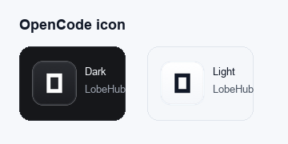

# Agent Icon Workflow

This document records how Across Agents Assistant prepares local-agent and
cloud-LLM icons for the macOS app. The goal is to show recognizable provider
marks in the UI while keeping the app's own branding separate from third-party
brands.

## Final Preview

The current icon set uses paired dark/light assets:


OpenCode was checked separately after centering fixes:



## Design Target

The app uses the same visual language as the original OpenClaw and Hermes
icons:

- dark mode: black/graphite rounded tile
- light mode: white rounded tile
- subtle border and inner highlight
- provider glyph centered inside the tile
- no provider mark is used as Across Agents Assistant branding

The tile is app-owned UI chrome. The third-party glyph remains a descriptive
provider identifier.

## Source Strategy

The implementation was inspired by CC Switch. CC Switch is a Tauri/Rust app
that bundles provider SVGs into its frontend instead of discovering loose image
files from the app bundle at runtime. Its source uses `@lobehub/icons-static-svg`
and generates an embedded icon index for provider rendering.

Across Agents Assistant uses a similar source strategy, but with explicit
source tracking:

- most provider glyphs, including Claude Desktop, come from
  `@lobehub/icons-static-svg@1.73.0`
- Codex, Hermes, and OpenClaw use LobeHub WebP exports as primary assets and
  upstream `@lobehub/icons-static-svg@1.91.0` files as fallbacks. This avoids a
  visible path defect in the reviewed Codex color SVG while still keeping the
  icon source tied to LobeHub rather than project-drawn substitutes
- Claude Code uses the dedicated `@lobehub/icons-static-svg@1.91.0` glyph so it
  does not collide with Claude Desktop
- OpenCode uses `@lobehub/icons-static-svg@1.91.0`
  because that version adds `opencode.svg`
- Kimi Code uses `@lobehub/icons-static-svg@1.91.0`
  for the current `kimi-color.svg` glyph
- Agnes uses a project-created `Ag` compatibility tile because no reusable
  open-source Agnes brand glyph was found in `@lobehub/icons-static-svg@1.91.0`,
  Simple Icons 16.24.0, or lucide-static 1.21.0
- bundled source icons are preferred over installed app icons so compact
  sidebar icons do not inherit macOS app-icon shadows, halos, or transparent
  outer edges
- installed local app icons are fallback-only for agents without a usable
  bundled SVG tile
- all bundled icon provenance is recorded in
  `macOS-Client/Sources/Assets/icons/agent-icon-sources.json`
- third-party notices are recorded in `THIRD_PARTY_NOTICES.md`

## Bundled Icons

Bundled SVG tile pairs live under:

`macOS-Client/Sources/Assets/icons/agent.*.svg`

The lightweight backend web/fallback UI keeps its own icon copies under:

`backend/src/across_agents_assistant/assets/icons/agent.*.svg`

When a local-agent icon is used in both places, both copies must be kept on the
same upstream source file. The `local` backend alias uses the same WebP and SVG
fallback as OpenClaw.

Current bundled coverage:

| Agent/provider | Asset base | Source |
| --- | --- | --- |
| OpenClaw | `agent.openclaw` | LobeHub `openclaw-color.webp`, with `openclaw-color.svg` fallback from `@lobehub/icons-static-svg@1.91.0` |
| Hermes | `agent.hermes` | LobeHub `hermesagent.webp`, with `hermesagent.svg` fallback from `@lobehub/icons-static-svg@1.91.0` |
| OpenCode | `agent.opencode` | LobeHub `opencode.svg` |
| Claude Code | `agent.claude` | LobeHub `claudecode-color.svg` from `@lobehub/icons-static-svg@1.91.0` |
| Claude Desktop | `agent.claude-desktop` | LobeHub `claude-color.svg` |
| Codex | `agent.codex` | LobeHub `codex.webp`, with `codex.svg` fallback from `@lobehub/icons-static-svg@1.91.0` |
| Kimi Code | `agent.kimi` | LobeHub `kimi-color.svg` from `@lobehub/icons-static-svg@1.91.0` |
| Cursor | `agent.cursor` | LobeHub `cursor.svg` |
| OpenAI | `agent.openai` | LobeHub `openai.svg` |
| Anthropic | `agent.anthropic` | LobeHub `anthropic.svg` |
| DeepSeek | `agent.deepseek` | LobeHub `deepseek-color.svg` |
| MiniMax | `agent.minimax` | LobeHub `minimax-color.svg` |
| Agnes | `agent.agnes` | Project-original `Ag` compatibility tile; no Agnes glyph in the reviewed open-source icon packages |
| Alibaba Bailian / Qwen | `agent.bailian` | LobeHub `qwen-color.svg` |
| Moonshot / Kimi | `agent.moonshot` | LobeHub `kimi-color.svg` |
| Zhipu GLM | `agent.zhipu` | LobeHub `zhipu-color.svg` |
| Volcengine Ark / Doubao | `agent.volcengine` | LobeHub `doubao-color.svg` |
| Google Gemini | `agent.google` | Stabilized Gemini sparkle tile |
| xAI | `agent.xai` | LobeHub `xai.svg` |
| Mistral AI | `agent.mistral` | LobeHub `mistral-color.svg` |
| Groq | `agent.groq` | LobeHub `groq.svg` |
| Cohere | `agent.cohere` | LobeHub `cohere-color.svg` |
| OpenRouter | `agent.openrouter` | LobeHub `openrouter.svg` |
| Together AI | `agent.together` | LobeHub `together-color.svg` |
| Fireworks AI | `agent.fireworks` | LobeHub `fireworks-color.svg` |

There are currently no bundled `agent.*.png` files. OpenCode was converted to a
tile SVG so it has both dark and light variants.

## Runtime Local App Icons

Installed app icons are treated as fallback-only because macOS `.icns` assets
often include app-icon shadows, edge glow, or outer transparency that create
visible halos when rendered in the compact sidebar.

| Agent | Runtime app icon candidates |
| --- | --- |
| Cursor | `/Applications/Cursor.app`, `~/Applications/Cursor.app` |

The app only reads fallback icons from the user's machine with `NSWorkspace`.
Codex and Claude Desktop intentionally stay bundled-first to match Kimi Code,
OpenCode, and Cursor visual treatment.

## Loading Order

The Swift icon loader uses this order:

1. user override from Application Support
2. bundled SVG/light SVG asset
3. installed local app icon fallback for agents without a bundled tile
4. fallback initials/system icon

User override directories:

- `~/Library/Application Support/AcrossAgentsAssistant/Icons`
- `~/Library/Application Support/Across Agents Assistant/Icons`

Supported override extensions:

- `.webp`
- `.png`
- `.svg`
- `.icns`

## Processing Notes

The icon tile generator normalizes provider glyphs into a `100x100` SVG tile.
Most glyphs are scaled into a centered `52x52` visual area. The dark and light
backgrounds are kept separate as `agent.<id>.svg` and
`agent.<id>.light.svg`.

OpenCode now uses the LobeHub `opencode.svg` mark with a `24x24` view box. The
tile transform matches the other monochrome provider glyphs:

```svg
translate(24 24) scale(2.16667)
```

Codex uses the LobeHub `codex.webp` export instead of the generic OpenAI mark
because the reviewed Codex color SVG has a visible path defect. Hermes uses
`hermesagent.webp`, and OpenClaw uses `openclaw-color.webp`. These files are
copied without wrapping them in an Across-owned tile. The backend web/fallback
copies for Hermes, OpenClaw, Codex, and the `local` alias use the same WebP
assets. The upstream LobeHub SVG files remain in the bundle as fallback assets.
Hermes is a black alpha-mask WebP, so the Swift UI renders it as a template icon
and supplies the visible foreground color at runtime. Claude Code uses
`claudecode-color.svg` instead of the generic Claude mark. Claude Desktop keeps
the generic `claude-color.svg` mark because no reviewed open-source package
currently provides a Claude Desktop-specific glyph.

Codex, Hermes, OpenClaw, and the `local` alias are direct WebP marks rather than
Across-owned neutral tiles. The Swift UI keeps the source files unchanged, but
renders these marks inset at 78% of their container so their visual weight
matches the original tile-based icons.

Agnes uses a project-original `Ag` compatibility tile. It is intentionally not
an official Agnes logo or brand glyph.

Google Gemini originally used the LobeHub `gemini-color.svg`, but macOS CoreSVG
rendered the gradient SVG too small inside the tile. The current Gemini tile
uses a stabilized sparkle glyph based on the Gemini visual form so the macOS
app renders it at the correct size.

## Cloud Providers

The app currently supports these cloud LLM providers in both the backend
registry and macOS UI:

- OpenAI
- Anthropic
- DeepSeek
- MiniMax
- Agnes
- Alibaba Bailian / Qwen
- Moonshot / Kimi
- Zhipu GLM
- Volcengine Ark / Doubao
- Google Gemini
- xAI
- Mistral AI
- Groq
- Cohere
- OpenRouter
- Together AI
- Fireworks AI

Perplexity was reviewed but not enabled as a provider in this pass because its
current OpenAI compatibility is Responses API-oriented, while this app's
existing LLM gateway adapter is Chat Completions-oriented. It should be added
after a Responses API adapter exists.

## Legal And Branding Notes

These icons are used descriptively to identify compatible agents and model
providers. They do not imply sponsorship, endorsement, or partnership.

The neutral black/white tile is treated as app UI chrome, not a modification of
the provider's brand. The app avoids using third-party marks as app branding,
launcher icons, marketing marks, or combined logos.

Before public binary release:

- review brand guidelines for each provider
- verify redistribution terms for the exact bundled assets
- keep `THIRD_PARTY_NOTICES.md` and `agent-icon-sources.json` in sync
- avoid bundling local app icons whose redistribution terms are unclear

## Verification

The latest icon update was verified with:

```bash
PYTHONPATH=backend/src pytest backend/tests/test_local_agent_health.py backend/tests/test_local_agent_timeout.py backend/tests/test_agent_icon_policy.py -q
PYTHONPATH=backend/src pytest backend/tests --ignore=backend/tests/e2e -q
PYTHONPATH=backend/src pytest backend/tests/e2e/test_auto_orchestration.py backend/tests/e2e/test_auto_orchestration_complex.py backend/tests/e2e/test_task_manager_e2e.py backend/tests/e2e/test_harness_e2e.py backend/tests/e2e/test_orphan_recovery_e2e.py -q
swift build --package-path macOS-Client --skip-update
./build_app.sh
bash scripts/open_source_check.sh
codesign --verify --deep --strict --verbose=2 "build/Across Agents Assistant.app"
```

The built app bundle was also checked to confirm it contains no bundled
`agent.*.png` files and includes the new SVG tile assets.
