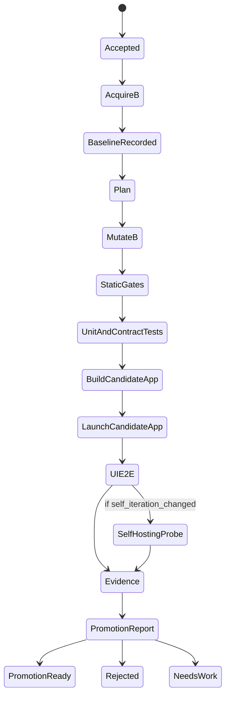

# Loop Engineering Self-Iteration Technical Plan

Status: final implementation plan for the AAA ecosystem self-iteration
pipeline. This document defines the architecture to implement before the next
development pass. It replaces earlier candidate-only or demo-oriented plans.

Authoritative architecture update: see
[`LOOP_ENGINEERING_REFERENCE_ARCHITECTURE.md`](LOOP_ENGINEERING_REFERENCE_ARCHITECTURE.md).
This candidate pipeline plan defines the A/B/C candidate execution and
validation mechanics inside that broader reference architecture. The reference
architecture owns the distinction between conformance loops and autonomous
product loops, the Tool Pack reuse model, durable artifacts/contracts/global
timeline, and builder/reviewer separation.

The current fixed two-file AAA self-iteration LoopSpec is a conformance fixture
for proving B-only mutation and packaged Candidate App validation. It must not
be treated as the final autonomous AAA product self-iteration loop.

## 1. Goal

Build a production-grade Loop Engineering pipeline where the stable AAA
ecosystem can discover or receive an improvement goal, use model-backed
engineering to modify an isolated candidate ecosystem, validate the candidate
end to end, and produce a promotion-ready evidence package without modifying the
stable source ecosystem.

The target behavior is:

```text
A stable controller -> modifies B candidate ecosystem -> validates B
  -> optionally asks B to operate on C probe -> writes promotion evidence
  -> protected promotion decides whether B becomes the next A
```

This is not a demo loop. A valid run must produce real candidate code changes,
run real validation against the candidate, and keep the stable source ecosystem
unchanged.

## 2. Non-Negotiable Decisions

1. A is the stable controller. It receives tasks, calls models, modifies B, runs
   gates, collects evidence, and owns failure handling.
2. A does not modify A during a self-iteration run.
3. B is a complete four-repository candidate ecosystem, not only an AAA clone.
4. B does not modify itself while B's own runtime is executing.
5. C is a disposable self-hosting probe used only when B changes self-iteration
   mechanisms.
6. Promotion from B to A is a separate protected action, not an Autopilot write.
7. Model keys remain owned by AAA host services. Plugins consume host commands
   and structured JSON, not raw model credentials.
   Candidate B receives model capability through a non-secret
   Candidate Model Capability Lease, and candidate app lifecycle verification
   must fail unless B reports `/api/llm/status` as available from
   `candidate_model_lease`. The lease may use the installed A backend Unix
   socket or a local host HTTP URL for CLI/E2E runs, but it must never transfer
   raw provider credentials.
8. Computer Use is a review-time Codex driver unless exposed through a
   product-owned host UI automation command.

## 3. Four Product Boundaries

### 3.1 Across Agents Assistant

AAA is the host and stable control plane.

Responsibilities:

- own user-facing Loop Workbench UI;
- own model/provider configuration and model credential access;
- expose host commands for model decision, code iteration, and UI automation;
- install and manage plugin runtimes;
- launch and monitor Autopilot runs;
- render candidate evidence, gates, diffs, and promotion reports;
- enforce local user consent for promotion, release, or destructive actions.

AAA must not:

- embed Autopilot's candidate repository logic;
- embed Orchestrator's loop execution engine;
- write raw model keys into plugin environments;
- silently promote B into A.

### 3.2 Across Autopilot

Autopilot is the automation planner and candidate pipeline owner.

Responsibilities:

- parse LoopSpec;
- acquire B candidate repositories;
- create candidate runtime roots;
- enforce allowed and denied path policies;
- call host model/code/UI commands through declared adapters;
- run validation gates;
- write candidate evidence and promotion reports;
- create patch bundles or PR-ready outputs.

Autopilot must not:

- read provider keys;
- own model selection;
- mutate A;
- trust B-reported success without independently checking evidence;
- depend directly on Codex-only MCP tools.

### 3.3 Across Orchestrator

Orchestrator is the generic loop execution engine.

Responsibilities:

- run loop steps;
- provide task, event, cancellation, recovery, and evidence metadata;
- expose plugin protocol surfaces;
- make long-running loop state observable and resumable.

Orchestrator must not:

- know AAA-specific product release policy;
- own candidate repository promotion;
- read provider keys;
- make final product acceptance decisions.

### 3.4 Across Context

Context is the memory and protocol documentation layer.

Responsibilities:

- store pending loop memory;
- record reflection summaries, failure lessons, and reusable run knowledge;
- document LoopSpec, evidence, adapter, and promotion schemas;
- expose memory candidates for review before durable acceptance.

Context must not:

- execute code mutation;
- run validation gates;
- decide promotion;
- become a hidden dependency for candidate runtime correctness.

## 4. A/B/C Architecture

### 4.1 A: Stable Controller

A is the currently trusted installed ecosystem:

```text
stable AAA + stable Orchestrator + stable Context + stable Autopilot
```

A owns the control loop:

1. accepts a task from user, schedule, issue, telemetry, or research;
2. builds bounded context;
3. calls the host model/code adapter;
4. writes changes only to B;
5. launches B validation;
6. independently verifies B evidence;
7. writes the final promotion report.

A is read-only with respect to its own source tree during the run. Any write to
A source, A runtime secrets, or A release metadata is a hard gate failure unless
the user explicitly runs a separate promotion action.

### 4.2 B: Candidate Ecosystem

B is the candidate version of the complete product ecosystem. It is created per
run under `$ACROSS_HOME`:

```text
$ACROSS_HOME/data/across-autopilot/candidate-workspaces/<candidate_id>/repos/across-agents-assistant/
$ACROSS_HOME/data/across-autopilot/candidate-workspaces/<candidate_id>/repos/across-orchestrator/
$ACROSS_HOME/data/across-autopilot/candidate-workspaces/<candidate_id>/repos/across-context/
$ACROSS_HOME/data/across-autopilot/candidate-workspaces/<candidate_id>/repos/across-autopilot/
```

Every B repository has:

- its own `.git`;
- explicit baseline commit or tag;
- candidate branch;
- clean status before mutation;
- diff and status recorded after mutation.

B may change one repo or multiple repos. The candidate manifest still pins all
four repositories so cross-repo tests always run against a coherent candidate
ecosystem.

B runtime data used by a packaged Candidate App must use a short app-safe
runtime key under `$HOME/.across/c` by default.
This is a hard macOS app-launch constraint, not a cosmetic path preference.
`NWEndpoint.unix(path:)` can abort the frontend process when the Unix socket
path is too long.

```text
$HOME/.across/c/<yyyymmddThhmmssZ>-<hash>/
$HOME/.across/c/<yyyymmddThhmmssZ>-<hash>/aaa/
```

All B validation commands must set:

```text
ACROSS_HOME=$HOME/.across/c/<runtime_key>
ACROSS_AGENTS_HOME=$HOME/.across/c/<runtime_key>/aaa
```

`ACROSS_CANDIDATE_RUNTIME_ROOT` may override this only when the resulting
socket path still passes the 103-byte preflight. Candidate workspaces, source
mirrors, run evidence, and reports still live under the loop's `ACROSS_HOME`.

The candidate runtime preflight must prove:

- the backend socket path is at most 103 UTF-8 bytes;
- A and B may run at the same time because they use different runtime homes;
- the same B runtime cannot launch more than one Candidate App instance;
- Candidate App frontend/backend/MCP processes are cleaned up after validation;
- no new Candidate App crash report is created during packaged-app validation.

### 4.3 C: Self-Hosting Probe

C is required only when B changes self-iteration machinery, including:

- Autopilot candidate acquisition;
- Autopilot mutation, gate, evidence, or promotion logic;
- Orchestrator loop execution, event, cancellation, or recovery logic;
- LoopSpec schema;
- host adapter protocol;
- model/code agent adapter;
- UI automation gate contract.

C is disposable and never promoted:

```text
$ACROSS_HOME/data/across-autopilot/candidate-workspaces/<candidate_id>/probe-workspaces/<probe_id>/repos/...
```

Self-hosting proof flow:

```text
A stable controller -> creates/modifies B
B candidate runtime -> creates/modifies C
A stable controller -> verifies B's C-run evidence
```

This proves B can control the next iteration after promotion without allowing B
to mutate itself in place.

## 5. Source Acquisition

### 5.0 Prepared Source Mirror Mode

Prepared source mirror mode is the default for installed, unattended local
self-iteration runs.

The developer checkouts may live in protected folders such as:

```text
$HOME/Documents/projects/
```

The installed AAA app must not depend on reading those paths during an
unattended Loop Engineering run, because macOS may require an interactive
Documents permission prompt. Before the loop starts, A prepares source mirrors
under:

```text
$ACROSS_HOME/data/across-autopilot/source-mirrors/
```

The mirrors are built from the four developer checkouts with:

```text
git ls-files --cached --others --exclude-standard
```

Each mirror is initialized as an independent git repository with a baseline
commit. Autopilot then resolves source paths from the mirror root unless an
explicit `ACROSS_*_SOURCE` override is present.

Prepared source mirror mode has these properties:

- the source-mirror preparation step is the only step that reads the developer
  checkout path;
- the installed AAA runtime, B workspaces, C probe workspaces, evidence, and
  reports live under `$ACROSS_HOME`;
- B never mutates the mirror source;
- B still receives independent candidate copies under
  `$ACROSS_HOME/data/across-autopilot/candidate-workspaces/<candidate_id>/repos`;
- evidence records the mirror source path and candidate target path for each
  repository.

### 5.1 Clean Ref Mode

Clean ref mode is required for promotion-ready candidates.

Inputs:

- repo URL or trusted local source path;
- immutable commit SHA or tag for each of the four repos;
- candidate id;
- candidate branch name.

Procedure:

1. Create the B workspace.
2. Clone each repo from the explicit ref.
3. Create a candidate branch such as `autopilot/<candidate_id>`.
4. Record source URL, baseline ref, current HEAD, and dirty status.
5. Fail if any repo is dirty before mutation.

### 5.2 Snapshot Mode

Snapshot mode is allowed only for local experiments.

Procedure:

1. Copy source trees into B with excludes for build outputs, caches, runtime
   data, virtual environments, local secrets, and ignored files.
2. Initialize or preserve independent git metadata in B.
3. Commit the copied state as `candidate baseline` if needed.
4. Mark evidence as `snapshot_candidate=true`.

Snapshot candidates cannot be promoted until reproduced in clean ref mode.

## 6. Mutation And Policy

### 6.1 Allowed Paths

Allowed paths are declared per repo in LoopSpec.

Default AAA candidate paths:

```text
backend/src/
backend/tests/
macOS-Client/Sources/
macOS-Client/Tests/
scripts/
docs/
*.md
```

Default Autopilot candidate paths:

```text
src/
tests/
scripts/
docs/
*.md
```

Default Orchestrator candidate paths:

```text
src/
tests/
docs/
*.md
```

Default Context candidate paths:

```text
src/
tests/
docs/
*.md
```

### 6.2 Denied Paths

Denied paths apply to every repo:

```text
.git/
.env
*.pem
*.p12
*.mobileprovision
*.key
credentials*
secrets*
release tags
signing identities
notarization credentials
$ACROSS_HOME/data/across-agents-assistant/
$ACROSS_HOME/config/across-agents-assistant/
```

Release metadata is read-only unless explicitly unlocked by a release-candidate
LoopSpec:

```text
CHANGELOG.md
README.md release badges
backend/pyproject.toml
backend/src/across_agents_assistant/__init__.py
package.json version fields
```

### 6.3 Mutation Execution

Autopilot never edits files directly through ad hoc shell text substitution.
It uses a declared mutation adapter:

- `host_model_patch`: bounded patch returned by AAA host model command;
- `host_code_agent`: coding agent command run with working directory set to B;
- `scripted_transform`: deterministic repository transform with declared
  inputs and outputs.

All adapters must return:

- changed files;
- diff summary;
- model/tool provenance;
- validation commands attempted;
- structured failure details.

### 6.4 Validation Repair Loop

Candidate validation is not a one-shot assertion. If B fails a declared
validation command, A may perform one bounded repair attempt before final gate
evaluation:

1. A records the failing command, exit code, stdout, and stderr in evidence.
2. A calls the same host code-iteration boundary with `validation_feedback`.
3. The repair remains constrained to the original `allowed_patch_paths`.
4. A reruns candidate diff and all declared validation commands.
5. Promotion evidence and final gates use the latest diff and validation
   result, while preserving the failed first attempt for audit.

The repair loop is intentionally bounded. It is a quality-control mechanism,
not an unbounded autonomous coding session. If the repair attempt fails, the
candidate remains rejected and the evidence package explains why.

## 7. Model Boundary

AAA owns provider credentials and model routing.

Autopilot and Orchestrator receive only host commands:

```json
{
  "model_decision": {
    "driver": "host_command",
    "command": ["autopilot-model-decision"]
  },
  "code_iteration": {
    "driver": "host_command",
    "command": ["autopilot-code-iteration"]
  }
}
```

The host command may use one or more models. Evidence must record:

- provider family or local model family;
- model name when safe to disclose;
- prompt template version;
- tool permissions;
- input file list;
- output diff summary;
- token/cost metadata when available.

The command must not expose raw API keys to plugin environments.

Candidate B receives model capability through a non-secret Candidate Model
Capability Lease, not by copying or symlinking AAA credentials. The lease is
written into the candidate runtime, points at the stable A host boundary, lists
allowed scopes such as `model.research`, `model.code_patch`, `model.review`, and
`model.chat`, and explicitly records `secrets_included=false` plus
`raw_credentials_allowed=false`. Candidate apps may use this lease to ask A for
model execution, but they must never read, store, mutate, or inherit raw provider
API keys from A.

## 8. UI Automation Boundary

Autopilot owns the UI gate schema. AAA owns the UI automation implementation.

```json
{
  "ui_automation": {
    "required": true,
    "driver": "host_command",
    "command": ["autopilot-ui-e2e"],
    "target_app": "$CANDIDATE_APP",
    "scenario": "loop-workbench-run",
    "timeout_seconds": 600
  }
}
```

Supported drivers:

- `codex_computer_use`: review-time validation from this Codex thread;
- `accessibility_cli`: product-owned macOS Accessibility command;
- `xctest_ui`: repeatable macOS UI test harness;
- `backend_socket`: development fallback only, not release-candidate UI proof.

Computer Use must not be a hard runtime dependency of Autopilot. If future
Codex exposes a stable product-safe UI automation bridge, AAA can wrap it as a
host command without changing Autopilot.

## 9. Candidate App

B must build a separate Candidate app:

```text
$ACROSS_HOME/data/across-autopilot/candidate-apps/<candidate_id>/Across Agents Assistant Candidate.app
```

The bundle must use a distinct local identity:

```text
Display name: Across Agents Assistant Candidate
Bundle id: app.acrossagents.assistant.candidate.<candidate_id>
```

Candidate app launch requirements:

- A app can remain installed without bundle collision.
- Candidate app runs with B candidate `ACROSS_HOME`.
- Candidate app uses B plugin refs and B candidate runtime.
- Candidate app writes no production A runtime data.

## 10. Pipeline State Machine



Hard failure states:

- source A changed;
- denied path changed;
- secret detected;
- B pre-mutation dirty in clean ref mode;
- missing required evidence;
- candidate app failed to build;
- required UI E2E failed for release candidate;
- B modified itself during B runtime;
- B self-hosting probe failed when required.

## 11. Required Gates

Baseline gates:

- `candidate_workspace_created`
- `four_repo_manifest_written`
- `clean_ref_verified`
- `source_a_unchanged_pre`
- `candidate_b_clean_pre`

Mutation gates:

- `candidate_has_code_diff`
- `allowed_paths_only`
- `denied_paths_absent`
- `secret_scan_passed`
- `source_a_unchanged_post_mutation`

Validation gates:

- `open_source_check_passed`
- `backend_tests_passed`
- `swift_behavior_passed`
- `orchestrator_contract_tests_passed` when Orchestrator changed
- `autopilot_contract_tests_passed` when Autopilot changed
- `context_contract_tests_passed` when Context changed
- `cross_repo_contract_tests_passed`

App gates:

- `candidate_app_built`
- `candidate_app_signed_for_local_validation`
- `candidate_app_launches`
- `candidate_app_uses_candidate_home`
- `ui_e2e_passed`

Self-hosting gates when required:

- `probe_c_workspace_created`
- `b_runtime_operated_on_c`
- `probe_c_has_expected_diff`
- `a_verified_b_probe_evidence`

Promotion gates:

- `promotion_report_written`
- `patch_bundle_written`
- `rollback_plan_written`
- `human_approval_required`

## 12. Evidence Schema

Top-level evidence:

```json
{
  "run_id": "string",
  "candidate_id": "string",
  "mode": "clean_ref|snapshot",
  "controller": {
    "product": "across-agents-assistant",
    "version": "string",
    "source_unchanged": true
  },
  "repos": {
    "across-agents-assistant": {
      "path": "string",
      "baseline_ref": "string",
      "head_ref": "string",
      "changed_files": ["string"]
    }
  },
  "runtime": {
    "candidate_across_home": "string",
    "candidate_app": "string"
  },
  "model": {
    "provider_family": "string",
    "model": "string",
    "prompt_template_version": "string",
    "tool_permissions": ["string"]
  },
  "gates": [
    {
      "name": "string",
      "status": "passed|failed|blocked|skipped",
      "required": true,
      "evidence_path": "string"
    }
  ],
  "ui_e2e": {
    "driver": "codex_computer_use|accessibility_cli|xctest_ui|backend_socket",
    "status": "passed|failed|blocked",
    "scenario": "string"
  },
  "self_hosting_probe": {
    "required": false,
    "status": "skipped|passed|failed",
    "probe_id": "string"
  },
  "promotion": {
    "decision": "ready|rejected|needs_work",
    "patch_bundle": "string",
    "rollback_plan": "string"
  }
}
```

Publishable reports must redact raw secrets, personal tokens, provider keys, and
sensitive screenshots. Local absolute paths may appear only in local evidence
under `$ACROSS_HOME`.

## 13. Promotion Boundary

Autopilot does not write B changes back to A.

Promotion procedure:

1. A writes patch bundle from B.
2. A writes promotion report.
3. Human reviewer or protected reviewer model checks evidence.
4. A separate promotion command opens PRs or applies patches to A.
5. A-side CI and release gates run again.
6. Only after approval can B become the new stable A.

Promotion must preserve rollback:

- baseline refs;
- patch bundle;
- changed files;
- validation log paths;
- candidate app path;
- release notes draft;
- revert instructions.

## 14. External Research Basis

This design combines established engineering patterns:

- compiler bootstrap: multi-stage build and compare before trusting the new
  toolchain;
- coding-agent sandbox loop: agent modifies isolated repo and validates through
  tests before PR;
- trace/eval improvement loop: failures and telemetry produce future tasks;
- progressive delivery: candidate promotion or rollback is decided by analysis
  and gates;
- protected deployment: promotion requires explicit environment or reviewer
  approval.

The local A/B/C naming is AAA-specific. The underlying safety rule is standard:
do not allow an untrusted candidate to mutate the trusted controller that is
responsible for recording evidence and rollback.

## 15. Implementation Plan

The implementation should be done as one integrated platform increment.

Autopilot:

1. implement four-repo candidate acquisition;
2. implement clean ref and snapshot modes;
3. implement candidate runtime root creation;
4. implement path policy and source-unchanged gates;
5. implement mutation adapter execution;
6. implement validation gate runner;
7. implement self-hosting C probe trigger;
8. implement promotion report and patch bundle output.

AAA:

1. expose model decision host command;
2. expose code iteration host command;
3. expose UI automation host command;
4. show candidate runs, gates, diffs, and promotion reports in Loop Workbench;
5. build Candidate app with distinct display name and bundle id;
6. launch Candidate app with candidate `ACROSS_HOME`;
7. enforce human approval for promotion/release.

Orchestrator:

1. carry candidate run metadata through loop events;
2. preserve cancellation, recovery, correlation, and evidence ids;
3. expose contract tests for candidate loop steps;
4. remain generic and product-agnostic.

Context:

1. document LoopSpec, evidence, adapter, and promotion schemas;
2. store pending reflection memory and failure lessons;
3. keep memory writes reviewable and non-executing.

## 16. End-To-End Acceptance

A final implementation is accepted only when one real run proves:

1. A starts a self-iteration task from the UI or host API.
2. B is created as a four-repo candidate ecosystem.
3. The model-backed code agent makes a real code-level change in B.
4. A remains unchanged.
5. B passes path, secret, source-unchanged, unit, contract, and build gates.
6. B builds a distinct Candidate app.
7. Candidate app launches with candidate `ACROSS_HOME`.
8. A UI-level E2E runs against the Candidate app through a host UI driver.
9. If self-iteration code changed, B operates on C and A verifies the evidence.
10. A writes a promotion report, patch bundle, and rollback plan.
11. No release, tag, merge, or A-source write happens without explicit approval.

## 17. Default Policy

Default release-candidate policy:

- use clean ref mode;
- require all four repos in manifest;
- require candidate app UI E2E;
- require C probe when self-iteration mechanism changes;
- block promotion on failed required gate;
- block promotion on backend-only UI fallback;
- require human approval for PR, merge, tag, or release.

Default developer-experiment policy:

- snapshot mode allowed;
- backend socket UI fallback allowed only as `blocked_non_release`;
- C probe may be skipped only if self-iteration mechanisms were not changed;
- output cannot be promoted directly.

## 18. Summary

The final architecture is:

```text
A stable AAA ecosystem acts as the automation engineer.
B is the isolated four-repo candidate product ecosystem.
C is the disposable self-hosting probe used only for self-iteration changes.
```

This lets AAA replace the human/Codex execution role for routine iteration while
keeping a trusted controller, isolated candidates, verifiable evidence, and a
protected promotion boundary.
