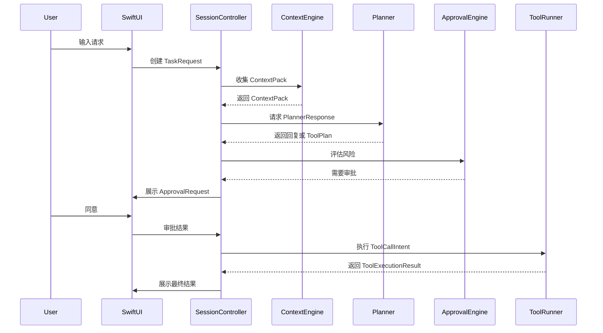

# Across Agents Assistant - Context Pack 与工具协议规范

## 1. 文档目标
本文档定义 Across Agents Assistant 在 MVP 阶段的核心协议，包括 `ContextPack`、Planner 输出、工具注册信息、审批请求和工具执行结果，用于统一 Swift UI 层、系统能力层、Agent 编排层和工具执行层之间的数据契约。

## 2. 设计原则
- 协议优先结构化，避免自然语言隐式约定。
- 所有高风险动作必须可审计、可预览、可重放元数据。
- 协议应可扩展，但 MVP 阶段尽量保持字段精简。
- 所有对象必须包含版本字段，便于后续升级兼容。

## 3. 顶层对象
MVP 建议统一使用以下顶层对象：
- `TaskRequest`
- `ContextPack`
- `PlannerResponse`
- `ToolDescriptor`
- `ToolCallIntent`
- `ApprovalRequest`
- `ToolExecutionResult`
- `TaskRecord`

## 4. TaskRequest
### 4.1 说明
表示一次用户发起的任务输入，是会话控制层的入口对象。

### 4.2 示例
```json
{
  "version": "1.0",
  "request_id": "0d630e9e-cf5a-4eb0-9eb8-d6dd7d2dbe1b",
  "session_id": "session-001",
  "input_mode": "voice",
  "user_input": "帮我总结当前页面并起草一封跟进邮件",
  "trigger": {
    "type": "shortcut",
    "timestamp": "2026-04-21T10:00:00Z"
  }
}
```

### 4.3 字段定义
| 字段 | 类型 | 必填 | 说明 |
|---|---|---|---|
| version | string | 是 | 协议版本 |
| request_id | string | 是 | 请求唯一 ID |
| session_id | string | 是 | 会话 ID |
| input_mode | enum | 是 | `text` 或 `voice` |
| user_input | string | 是 | 用户原始输入 |
| trigger | object | 是 | 触发方式和时间 |

## 5. ContextPack
### 5.1 说明
表示一次任务使用的全部上下文信息。

**实际实现**（`api_server.py` 中的 `ContextPack` 类）只有 3 个字段：

```json
{
  "frontmost_app": "Google Chrome",
  "window_title": "客户方案 - Notion",
  "clipboard_text": "客户关注交付时间和价格"
}
```

### 5.2 字段定义
| 字段 | 类型 | 必填 | 说明 |
|---|---|---|---|
| frontmost_app | string | 否 | 前台应用名 |
| window_title | string | 否 | 窗口标题 |
| clipboard_text | string | 否 | 剪贴板文本 |

### 5.3 分层原则
- Tier 1：默认快速采集（frontmost_app, window_title, clipboard_text）
- Tier 2：按应用适配采集（通过工具如 `get_finder_context`、`get_xcode_context`）
- Tier 3：截图和 OCR 等重型上下文（**未实现**）

## 6. PlannerResponse
### 6.1 说明
表示模型对本次任务的结构化输出，既可用于纯回复，也可用于工具执行。

### 6.2 示例
```json
{
  "version": "1.0",
  "request_id": "0d630e9e-cf5a-4eb0-9eb8-d6dd7d2dbe1b",
  "mode": "tool_plan",
  "assistant_message": "我会先基于当前页面与剪贴板内容生成摘要，再为你创建一封邮件草稿。",
  "plan_summary": "读取剪贴板，参考当前页面标题，生成邮件草稿，不会直接发送。",
  "risk_level": "L2",
  "needs_approval": true,
  "tool_calls": [
    {
      "tool_name": "read_clipboard",
      "arguments": {}
    },
    {
      "tool_name": "create_email_draft",
      "arguments": {
        "subject": "关于本周客户跟进",
        "body": "您好，基于本周讨论，我们建议..."
      }
    }
  ],
  "fallback_message": "如果你不希望我创建草稿，我也可以只给你一版文本建议。"
}
```

### 6.3 字段定义
| 字段 | 类型 | 必填 | 说明 |
|---|---|---|---|
| version | string | 是 | 协议版本 |
| request_id | string | 是 | 请求 ID |
| mode | enum | 是 | `answer_only` 或 `tool_plan` |
| assistant_message | string | 是 | 展示给用户的解释性文本 |
| plan_summary | string | 否 | 工具计划摘要 |
| risk_level | enum | 否 | `L0` 到 `L3` |
| needs_approval | boolean | 否 | 是否需要审批 |
| tool_calls | array | 否 | 工具调用意图列表 |
| fallback_message | string | 否 | 审批拒绝或失败时的备用回复 |

## 7. ToolDescriptor
### 7.1 说明
定义一个工具的注册信息，是工具系统和审批引擎的基础元数据。

### 7.2 示例
```json
{
  "version": "1.0",
  "name": "write_workspace_file",
  "display_name": "写入工作区文件",
  "category": "draft",
  "risk_level": "L2",
  "requires_approval": true,
  "required_permissions": [],
  "allowed_targets": [
    "workspace"
  ],
  "timeout_ms": 5000,
  "input_schema": {
    "path": "string",
    "content": "string"
  },
  "output_schema": {
    "written": "boolean",
    "path": "string"
  }
}
```

### 7.3 最低要求
每个工具必须声明：
- 名称
- 展示名
- 分类
- 风险等级
- 是否审批
- 权限要求
- 允许访问范围
- 超时
- 输入 schema
- 输出 schema

## 8. ToolCallIntent
### 8.1 说明
表示一次准备执行的具体工具调用。

**注意**：实际代码中，LLM 不使用原生 tool calling，而是输出 JSON 格式的 markdown 代码块。

### 8.2 LLM 调用方式
实际实现（`api_server.py`）要求 LLM 输出 markdown JSON 代码块：

```json
{
  "plan_summary": "我将搜索本地知识库",
  "tool_calls": [
    {"name": "local_kb__search_local_wiki", "args": {"query": "目标关键词"}}
  ]
}
```

Prompt 中的关键指示：
```
You MUST output a raw markdown JSON code block in your response text...
DO NOT TRY TO USE `<invoke>`, `<function_calls>`, OR ANY NATIVE TOOL CALLING SYNTAX FOR THEM!
```

### 8.3 Intent 解析
`intent_parser.py` 中的 `ToolIntentParser.parse_intent()` 使用正则表达式解析：
```python
json_pattern = re.compile(r'```json\s*(\{.*?\})\s*```', re.DOTALL)
match = json_pattern.search(llm_output)
```

### 8.4 ToolDescriptor 示例
```json
{
  "name": "list_directory",
  "risk_level": "low",
  "input_schema": {
    "type": "object",
    "properties": {
      "path": {"type": "string", "description": "目录路径"}
    },
    "required": ["path"]
  }
}
```

## 9. ApprovalRequest
### 9.1 说明
表示一次需要用户决策的审批请求。

**实际实现**（`api_server.py` 中 `ChatResponse.approval_request`）只有 4 个字段：

```json
{
  "tool_name": "create_email_draft",
  "risk_level": "medium",
  "tool_args": {
    "recipient": "example@email.com",
    "subject": "下周会议确认",
    "body": "..."
  },
  "description": "Create an email draft in the macOS Mail app."
}
```

### 9.2 字段定义
| 字段 | 类型 | 必填 | 说明 |
|---|---|---|---|
| tool_name | string | 是 | 工具名称 |
| risk_level | string | 是 | 风险等级（"low" / "medium"） |
| tool_args | object | 是 | 工具参数 |
| description | string | 是 | 工具描述 |

### 9.3 用户可选动作
实际支持：`approve`, `reject`, `always_allow`

**注意**：`approve_once`、`convert_to_draft`、`cancel` 选项当前未实现。

## 10. ApprovalDecision
### 10.1 说明
表示用户对审批请求的决策。

**实际实现**（`api_server.py` 中的 `ApprovalDecision` 类）：

```json
{
  "session_id": "session-001",
  "decision": "approve",
  "tool_name": "create_email_draft",
  "tool_args": {...},
  "agent_id": "openclaw"
}
```

### 10.2 字段定义
| 字段 | 类型 | 必填 | 说明 |
|---|---|---|---|
| session_id | string | 是 | 会话 ID |
| decision | string | 是 | 决策：`approve`, `reject`, `always_allow` |
| tool_name | string | 是 | 工具名称 |
| tool_args | object | 是 | 工具参数 |
| agent_id | string | 是 | Agent ID（默认 "openclaw"） |

### 10.3 决策处理
- `approve`：执行一次工具调用
- `reject`：拒绝执行，终止任务
- `always_allow`：将工具加入"始终允许"列表，下次自动执行

### 10.4 数据库中的审计表
`db/database.py` 中实际有以下表：
- `sessions`：会话记录
- `messages`：消息记录（role: user/assistant/tool）
- `audit_logs`：审批决策日志
- `tool_authorizations`：工具"始终允许"配置

**注意**：`TaskRecord` 表当前不存在。
### 12.1 建议结构
```json
{
  "code": "PERMISSION_SCREEN_RECORDING_MISSING",
  "message": "缺少屏幕录制权限，无法采集截图。",
  "retryable": false,
  "suggestion": "请在系统设置中授权屏幕录制，或关闭截图上下文。"
}
```

### 12.2 推荐错误码分类
- `PERMISSION_*`
- `TOOL_*`
- `MODEL_*`
- `CONTEXT_*`
- `APPROVAL_*`
- `SYSTEM_*`

## 13. 协议版本策略
- 所有顶层对象必须包含 `version` 字段。
- 新增字段尽量采用向后兼容方式。
- 删除字段或修改语义时，必须升级主版本并同步更新所有文档。

## 14. 序列图


## 15. 实施注意事项
- 协议字段命名必须统一，避免同一概念在不同模块使用不同名字。
- 所有跨进程通信对象建议序列化为 JSON。
- 审批请求和任务记录需要可溯源，但避免长期保存高敏原文。
- 如果后续引入多 Agent，不要直接改写既有协议语义，应通过扩展字段实现。
