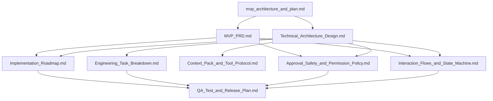

# Across Agents Assistant - 文档索引

## 1. 文档目标
本文档用于汇总 Across Agents Assistant 在 MVP 阶段的核心文档，说明每份文档的用途、阅读顺序和适用对象，帮助产品、设计、工程和测试在同一套边界下推进。

## 2. 推荐阅读顺序
建议按照以下顺序阅读：

1. `mvp_architecture_and_plan.md`
2. `MVP_PRD.md`
3. `Technical_Architecture_Design.md`
4. `Implementation_Roadmap.md`
5. `Engineering_Task_Breakdown.md`
6. `Context_Pack_and_Tool_Protocol.md`
7. `Approval_Safety_and_Permission_Policy.md`
8. `Interaction_Flows_and_State_Machine.md`
9. `QA_Test_and_Release_Plan.md`
10. `product_evolution_history.md`

## 3. 文档清单
### 3.1 方向与决策类
- `mvp_architecture_and_plan.md`
  - 项目最初的 MVP 构想、阶段计划和关键挑战。
  - 适合快速理解项目初始方向。

- `product_evolution_history.md`
  - 记录项目在不同产品方向上的探索与收敛过程。
  - 适合回溯为什么最终聚焦 macOS 本地 Agent。

### 3.2 产品定义类
- `MVP_PRD.md`
  - 定义目标用户、核心场景、MVP 边界、风险分级、隐私要求和成功指标。
  - 是产品范围和版本边界的主文档。

### 3.3 技术设计类
- `Technical_Architecture_Design.md`
  - 定义技术路线、总体架构、模块边界、关键数据结构和实施策略。
  - 是工程方案的主文档。

- `Context_Pack_and_Tool_Protocol.md`
  - 定义 Context Pack、工具描述、Planner 输出、审批请求和执行结果等协议。
  - 适合前后端、Swift/Python 混合架构以及工具接入开发。

- `Approval_Safety_and_Permission_Policy.md`
  - 定义权限申请原则、审批策略、风险分级、白名单约束和审计要求。
  - 是安全与合规边界文档。

- `Interaction_Flows_and_State_Machine.md`
  - 定义用户交互流程、状态机、异常流程、降级和恢复策略。
  - 适合 UI、客户端、编排层和测试共同对齐。

### 3.4 项目推进类
- `Implementation_Roadmap.md`
  - 定义阶段目标、按周里程碑、依赖关系和交付物。
  - 用于项目管理和迭代排期。

- `Engineering_Task_Breakdown.md`
  - 将架构拆解为工程任务包、验收标准和依赖关系。
  - 用于研发排期、任务分发和估时。

- `QA_Test_and_Release_Plan.md`
  - 定义测试矩阵、验收方式、灰度策略、发布检查项和上线阻断条件。
  - 用于测试和发布管理。

## 4. 文档之间的关系

## 5. 使用建议
- 讨论功能边界和版本范围时，以 `MVP_PRD.md` 为准。
- 讨论技术选型、模块职责和实现方式时，以 `Technical_Architecture_Design.md` 为准。
- 讨论接口和编排契约时，以 `Context_Pack_and_Tool_Protocol.md` 为准。
- 讨论安全策略、审批标准和权限行为时，以 `Approval_Safety_and_Permission_Policy.md` 为准。
- 讨论排期、任务拆解和测试发布时，以 `Implementation_Roadmap.md`、`Engineering_Task_Breakdown.md` 和 `QA_Test_and_Release_Plan.md` 为准。

## 6. 维护原则
- 新增需求先更新 `MVP_PRD.md`，再更新对应技术与执行文档。
- 新增工具、上下文字段或审批规则时，必须同步更新协议和安全策略文档。
- 任何影响发布边界的改动，必须同步更新路线图、任务拆解和测试发布计划。
