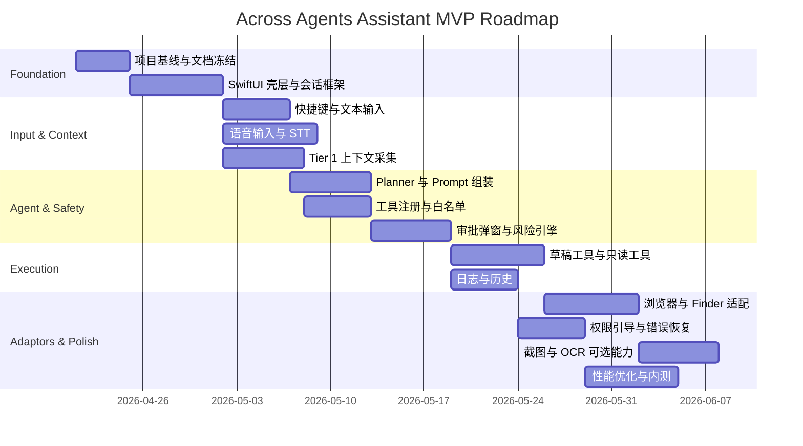

# Across Agents Assistant - 实施路线图

## 1. 文档目标
本文档用于将 MVP 产品目标和技术设计转化为可执行的实施路线图，明确阶段目标、里程碑、依赖关系、交付物和风险控制方式。

## 2. 规划原则
- 先完成可演示的闭环，再扩展能力覆盖面。
- 先做稳定低风险能力，再做重型上下文和高风险执行。
- 先支持少量高价值 App，再逐步增加适配范围。
- 所有阶段都必须保证可运行、可验证、可回退。

## 3. 团队假设
以下路线图基于一个轻量团队假设：
- 1 名产品负责人或创始人负责需求与优先级。
- 1 到 2 名客户端/桌面工程师负责 macOS 端与 UI。
- 1 名后端或通用工程师负责模型、工具编排和协议。
- 1 名测试或由研发兼任测试验证。

如果团队规模更小，应优先保证主链路而减少适配器范围。

## 4. 版本目标
### 4.1 Alpha 目标
- 打通完整主链路。
- 支持文本输入和至少一种语音输入方式。
- 支持 Tier 1 上下文。
- 支持只读问答和至少 2 个受控草稿工具。
- 支持审批弹窗和任务日志。

### 4.2 Beta 目标
- 扩展应用适配器（Finder、Xcode、Browser）。
- 加强错误恢复、权限引导、性能优化和观测能力。
- 引入 Model Context Protocol (MCP) 基础集成。

**注意**：MCP 实际在 Phase 5 实现，Phase 2 仅规划。

### 4.3 GA 前提
- 核心场景可稳定复用。
- 高风险动作无误执行。
- 关键权限、审批和降级路径经过充分验证。
- MCP 插件的可视化管理与安全隔离 (沙盒机制)。

## 5. 总体阶段划分

## 6. 分阶段计划
### Phase 0：基线冻结与技术准备
目标：
- 冻结 MVP 范围。
- 确认 Swift 与 Python 的边界。
- 确认首批支持场景和工具集合。

交付物：
- 产品与技术文档冻结版本。
- 技术选型结论。
- 仓库目录与模块草案。
- 最小演示脚本或原型链路图。

退出标准：
- 团队对 MVP 的非目标和风险边界有一致认知。
- 不再以“全自动通用代理”为第一版目标。

### Phase 1：基础输入与主界面
目标：
- 完成状态栏应用、浮窗、会话容器和输入入口。

范围：
- Menu Bar 常驻。
- 主窗口显示会话。
- 快捷键触发。
- 文本输入。
- 语音录音控制。

交付物：
- 可通过菜单栏和快捷键打开主界面。
- 可录制语音并显示识别中状态。
- 可提交用户请求。

退出标准：
- 用户可以稳定触发并提交一条任务。

### Phase 2：上下文与模型主链路
目标：
- 完成 Tier 1 上下文采集、Prompt 组装和普通问答。

范围：
- 前台应用、窗口标题、剪贴板、时间、语言环境。
- 模型客户端。
- Planner 基础输出格式。
- 任务日志初版。

交付物：
- 基于当前窗口和剪贴板生成回答。
- 在 UI 中展示上下文来源摘要。

退出标准：
- 普通问答任务链路稳定运行。

### Phase 3：审批与受控执行
目标：
- 完成工具白名单、审批 UI、风险判断和草稿工具。

范围：
- 只读工具。
- 草稿型工具。
- 风险分级。
- 审批弹窗。
- 执行结果展示。

交付物：
- 至少 2 个只读工具和 2 个草稿工具可用。
- 高风险动作能够被拦截并等待用户确认。

退出标准：
- 一条完整的“规划 -> 审批 -> 执行 -> 反馈”链路通过验收。

### Phase 4：应用适配与可选视觉上下文
目标：
- 提升上下文质量和场景覆盖。

范围：
- 浏览器适配。
- Finder 适配。
- IDE 基础适配。
- 截图和 OCR 的按需能力。

交付物：
- 支持从浏览器或 Finder 读取更具体的上下文。
- 截图与 OCR 可通过开关控制。

退出标准：
- 至少 3 个高频真实场景在内测中可重复使用。

### Phase 5：打磨、内测与发布准备 (M5)

**目标**：提升产品的商业级可用性，解决小白用户上手的系统权限痛点，并实现持久化记忆与全自动的推理闭环（Agent Loop）。
**范围**：
- **终极视觉上下文 (Tier 3)**：集成原生 macOS 截图与 OCR（Vision 框架），解决非标准文本的提取痛点。
- **本地记忆与审计 (SQLite 持久化)**：引入轻量级数据库，实现“断点续传”式的历史对话加载，以及高危工具调用的安全审计黑匣子 (Audit Logs)。
- **全自动推理循环 (Agent Loop)**：后端实现 `while` 循环推理机制，大模型调用工具后自动回收结果并进行第二次总结，无需用户手动追问。
- **极客级权限引导 (TCC)**：原生前置探测 macOS 辅助功能权限，提供优雅的 UI 警告和一键跳转“系统设置”的 Deep-Link，彻底消灭底层报错。
- **工具授权持久化 (Always Allow)**：针对高频安全工具提供“始终允许”选项，减少“红绿灯”弹窗打扰，提升极客效率。
- 完善日志、打包签名（Codesign），产出首个可内测的 `.dmg` / `.app`。

交付物：
- Beta 包。
- 内测反馈收敛清单。
- 发布 go/no-go 结论。

退出标准：
- 核心 bug 收敛，核心场景成功率达到预期。

### Phase 6：MCP 插件体系与体验打磨 (M6)

**目标**：完善 MCP 插件生态的易用性与安全性，提升产品细节体验，为正式 GA (General Availability) 做准备。
**范围**：
- **MCP 可视化配置增强**：
  - 支持在 UI 中显式显示当前激活的 MCP 上下文状态 (如：`[🗄️ SQLite: test.db]`)，增强用户感知。
  - 支持自定义第三方 MCP 服务器的参数配置面板 (Developer Mode)。
- **MCP 安全与防呆机制 (沙盒化)**：
  - 为 SQLite 等高危插件提供“强制只读模式 (Read-Only)”选项。
  - 限制文件选择器的作用域白名单，防止用户误选系统核心目录或重要生产库。
  - 在 Agent 输出中强制回显实际执行的底层指令 (如 SQL 语句)，提升调试透明度。
- **对话体验打磨 (UX Polish)**：
  - 优化对话气泡，支持 Markdown 代码高亮和流式输出 (Streaming) 效果。
  - 探索沉浸式语音模式的 UI 交互。
- 完善小白用户引导和插件配置文档。

交付物：
- 包含沙盒隔离机制的 MCP 管理面板。
- 体验升级后的会话流。
- 最终版产品使用文档。

退出标准：
- MCP 插件配置无误导，高危操作有强隔离。
- 会话交互流畅自然，无明显卡顿或格式错乱。

## 7. 每周建议排期
### Week 1
- 冻结文档。
- 初始化 SwiftUI 壳层。
- 设计会话状态模型。

### Week 2
- 完成菜单栏、快捷键、文本输入。
- 语音录音控制打通。

### Week 3
- 接入 STT。
- 打通基础模型问答。
- 接入 Tier 1 上下文。

### Week 4
- 完成 Planner 输出结构。
- 实现工具注册中心。
- 落地风险分级初版。

### Week 5
- 实现审批弹窗。
- 接入只读工具和草稿工具。
- 补齐任务日志。

### Week 6
- 浏览器和 Finder 适配。
- 优化权限引导和错误提示。

### Week 7
- 引入可选截图与 OCR。
- 做性能优化和超时控制。

### Week 8
- 组织内测。
- 修复高优先级问题。
- 准备 Beta 发布。

## 8. 关键依赖关系
- 没有会话状态机，就不应并行推进审批和工具执行。
- 没有工具 schema 和风险等级，就不应开放执行能力。
- 没有权限引导和降级策略，就不应过早引入截图和 OCR。
- 没有日志和错误归因，就不应进入较大范围内测。

## 9. 风险与缓冲
### 9.1 高风险事项
- macOS Accessibility 和屏幕录制权限申请体验差。
- 跨应用选中文本和结构化上下文获取不稳定。
- 语音、OCR、LLM 串联带来时延。
- Swift 与 Python 混合架构增加调试和打包复杂度。

### 9.2 缓冲策略
- 若适配器进度拖延，优先保留 Tier 1 上下文。
- 若 OCR 时延不可接受，降级为关闭默认 OCR，仅在手动开启时使用。
- 若混合架构成本过高，优先用单语言打通关键主链路。

## 10. 里程碑验收
### M1：输入链路可用
- 可以通过菜单栏或快捷键稳定发起一次任务。

### M2：问答链路可用
- 能利用基础上下文完成一次稳定回答。

### M3：审批执行链路可用
- 高风险动作会被拦截并且审批通过后才执行。

### M4：场景价值成立
- 至少 3 个内测场景能证明效率提升。

### M5：Beta 可发布
- [ ] 完成了 Tier 3 视觉能力（截图 OCR）。**（未实现）**
- [x] 引入了本地 SQLite 持久化会话历史与审计日志。
- [x] 跑通了 Agent Loop (全自动接续工具结果并回答)。
- [ ] 实现了 TCC 原生权限引导弹窗。**（未实现）**
- [x] 支持”始终允许”权限并跳过红绿灯审批。
- [ ] App 可在全新 Mac 上以最少配置顺利跑通主要场景。

### M6：MCP 与体验优化
- [ ] 显式显示 MCP 上下文状态
- [ ] MCP 强制只读与沙盒白名单
- [ ] UI 对话气泡 Markdown 渲染与流式输出
- [ ] 开发者模式自定义 MCP 面板

## 11. 文档联动要求
- 路线图调整后，必须同步更新 `Engineering_Task_Breakdown.md`。
- 新增上下文或工具能力后，必须同步更新 `Context_Pack_and_Tool_Protocol.md`。
- 新增审批策略后，必须同步更新 `Approval_Safety_and_Permission_Policy.md`。
- 新增关键用户流程后，必须同步更新 `Interaction_Flows_and_State_Machine.md`。
