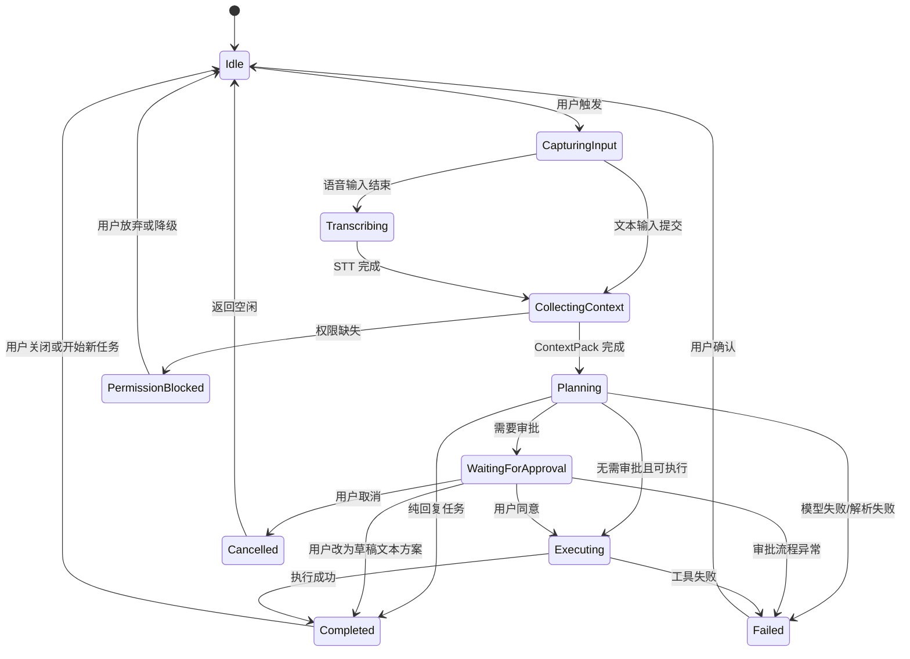
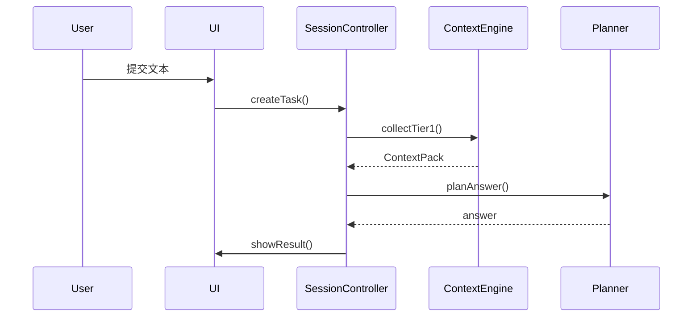
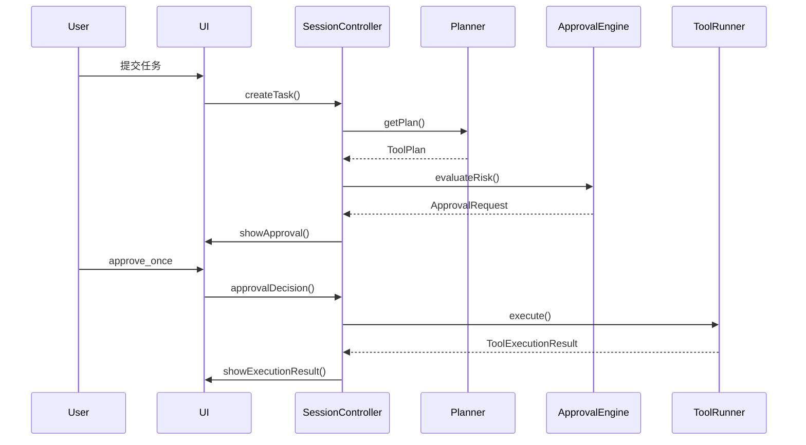

# Across Agents Assistant - 交互流程与状态机

## 1. 文档目标
本文档用于定义 Across Agents Assistant 在 MVP 阶段的关键用户流程、系统状态机、异常路径、降级策略和恢复策略，确保产品、设计、工程和测试对交互行为有统一认知。

## 2. 设计原则
- 用户必须清楚当前系统处于什么状态。
- 高风险路径必须显式中断并等待用户决策。
- 权限缺失、工具失败和模型失败都必须可解释。
- 任何阶段都应允许取消或结束任务。

## 3. 主要参与对象
- 用户
- UI 层
- SessionController
- ContextEngine
- Planner
- ApprovalEngine
- ToolRunner
- AuditLogger

## 4. 主状态机
### 4.1 会话主状态
MVP 推荐使用以下主状态：
- `Idle`
- `CapturingInput`
- `Transcribing`
- `CollectingContext`
- `Planning`
- `WaitingForApproval`
- `Executing`
- `Completed`
- `Failed`
- `PermissionBlocked`
- `Cancelled`

### 4.2 状态转移图

## 5. 标准交互流程
### 5.1 纯问答流程
1. 用户通过快捷键或状态栏触发助手。
2. 用户输入文本或语音。
3. 系统采集 Tier 1 上下文。
4. Planner 生成普通回答。
5. UI 展示结果和上下文来源摘要。
6. 写入任务日志。

### 5.2 工具执行流程
1. 用户触发任务。
2. 系统收集 ContextPack。
3. Planner 返回工具调用计划。
4. ApprovalEngine 评估风险等级。
5. 如果需要审批，UI 展示审批弹窗。
6. 用户同意后进入执行阶段。
7. ToolRunner 执行工具。
8. UI 展示执行结果。
9. AuditLogger 写入完整记录。

### 5.3 草稿替代流程
1. 用户发起带执行意图的请求。
2. 系统识别该任务存在高风险。
3. 审批 UI 中提供“改为草稿”选项。
4. 用户选择后，系统不执行外部动作，仅返回草稿内容或本地草稿对象。

## 6. 输入流程
### 6.1 文本输入
状态路径：

`Idle -> CapturingInput -> CollectingContext -> Planning`

要求：
- 提交后应立即锁定当前请求，避免重复点击造成并发任务。
- 输入框应支持取消当前任务。

### 6.2 语音输入
状态路径：

`Idle -> CapturingInput -> Transcribing -> CollectingContext -> Planning`

要求：
- 录音中必须有显著状态反馈。
- 转写中需显示加载状态。
- STT 失败时可允许用户编辑转写文本或切回文本输入。

## 7. 上下文流程
### 7.1 基础上下文采集
必须满足：
- 采集过程不应明显阻塞 UI。
- 采集结果在发送给模型前应形成标准化对象。

### 7.2 扩展上下文采集
适用场景：
- Planner 判断基础上下文不足。
- 当前应用属于支持的适配器。
- 用户开启截图/OCR 等可选能力。

### 7.3 上下文失败策略
- 如果适配器失败，回退到 Tier 1。
- 如果截图权限缺失，提示用户并继续无图模式。
- 如果选中文本不可读，提示用户复制到剪贴板再试。

## 8. 审批流程
### 8.1 审批前置条件
- 已拿到 Planner 输出。
- 已识别风险等级。
- 已构造审批请求对象。

### 8.2 审批 UI 最少信息
- 用户目标
- 执行计划
- 上下文读取来源
- 写入或发送目标
- 风险等级
- 可选动作

### 8.3 审批结果处理
- `approve_once`
  - 进入执行状态。
- `reject`
  - 停止执行并进入 `Cancelled` 或 `Completed`，同时给出替代建议。
- `convert_to_draft`
  - 不执行业务动作，仅返回草稿文本或草稿对象。
- `cancel`
  - 终止整个任务。

## 9. 执行流程
### 9.1 只读执行
- 通常无需审批。
- 结果可直接进入回答生成或展示。

### 9.2 写入执行
- 执行前必须确认目标路径、目标应用或目标对象。
- 执行后必须返回结构化结果。

### 9.3 失败处理
- 工具失败时进入 `Failed`。
- UI 应给出工具名、错误原因和可选重试方案。
- 审计日志中应记录失败类型和耗时。

## 10. 权限缺失流程
### 10.1 麦克风权限缺失
1. 用户触发语音输入。
2. 系统发现无麦克风权限。
3. UI 提示用途与授权路径。
4. 若用户不授权，则切换到文本输入。

### 10.2 Accessibility 权限缺失
1. 系统尝试读取窗口信息或自动化能力。
2. 权限不足。
3. UI 提示当前能力受限。
4. 系统退化为无障碍权限外的场景。

### 10.3 屏幕录制权限缺失
1. 用户开启截图/OCR 或任务确需截图。
2. 系统检查到权限不足。
3. 提示授权并给出关闭截图的替代路径。

## 11. 异常流程
### 11.1 模型失败
- 进入 `Failed`。
- 返回通用错误文案和重试入口。
- 保留原始请求摘要，便于快速重试。

### 11.2 工具超时
- 返回 `timeout`。
- UI 展示超时说明。
- 可选择重试或回退为只给建议。

### 11.3 用户主动取消
- 任何长任务应支持取消。
- 取消后状态进入 `Cancelled` 并清理临时资源。

## 12. UI 状态提示建议
每个状态建议有清晰提示文案：
- `CapturingInput`：正在录音或等待输入
- `Transcribing`：正在转写语音
- `CollectingContext`：正在读取当前上下文
- `Planning`：正在理解并规划任务
- `WaitingForApproval`：等待你的确认
- `Executing`：正在执行已批准的动作
- `Completed`：任务已完成
- `Failed`：任务失败，可查看原因
- `PermissionBlocked`：当前功能缺少权限

## 13. 关键序列图
### 13.1 文本问答序列

### 13.2 审批执行序列

## 14. 交互验收标准
- 用户在任一阶段都能理解当前系统正在做什么。
- 审批前用户能看清读取了什么、将做什么、写到哪里。
- 权限缺失时，功能降级路径明确。
- 失败后至少有一种下一步动作可选，例如重试、改为草稿、切换文本输入。

## 15. 文档联动要求
- 交互流程变更时，必须同步检查 `MVP_PRD.md` 中的范围定义。
- 状态机变更时，必须同步检查 `Technical_Architecture_Design.md` 中的会话设计。
- 审批交互变更时，必须同步检查安全策略文档。
