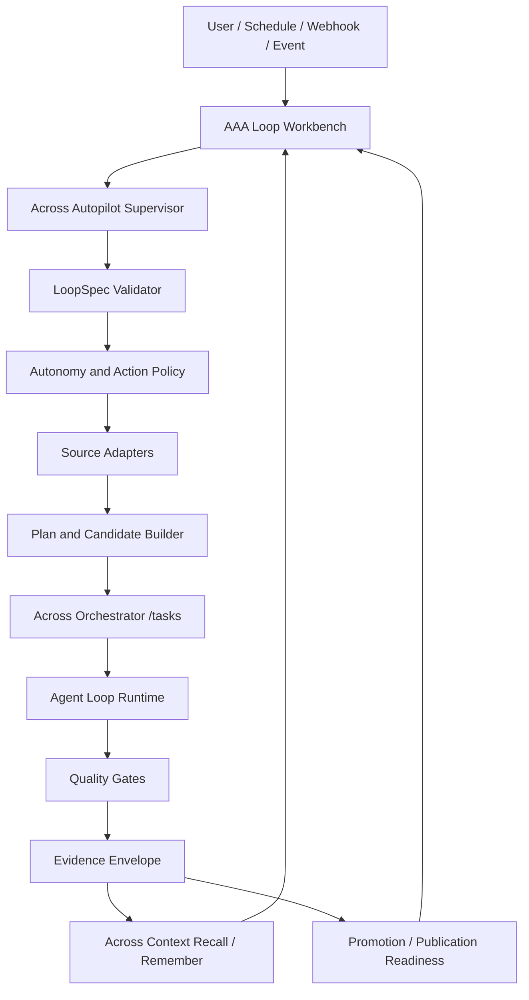
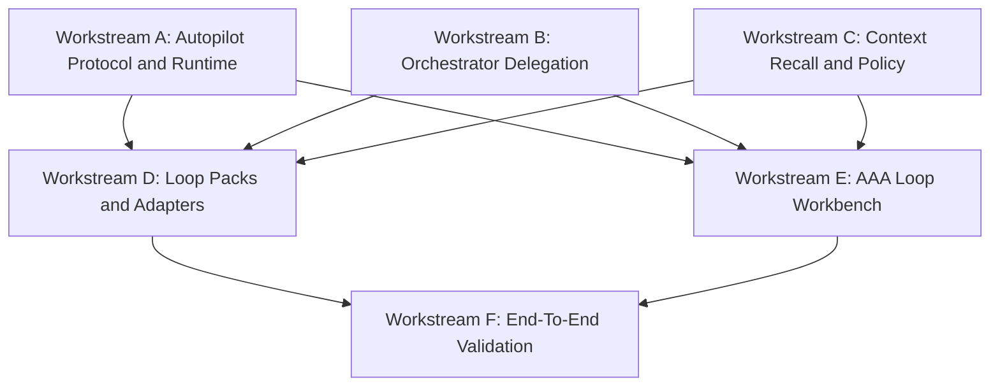

# Loop Engineering Platform Development Plan

Authoritative architecture update: see
[`LOOP_ENGINEERING_REFERENCE_ARCHITECTURE.md`](LOOP_ENGINEERING_REFERENCE_ARCHITECTURE.md).
Future Loop Engineering implementation must follow that reference architecture
when this plan and the reference architecture differ.

Important correction: fixed-target AAA self-iteration LoopSpecs are conformance
fixtures, not the production autonomous self-iteration loop. They may keep fixed
`candidate_targets` and fixed `allowed_patch_paths` only for deterministic E2E
and regression coverage. The production `aaa-autonomous-self-iteration` loop
uses model-generated candidate targets admitted by Autopilot policy from
artifacts, loop contracts, global timeline entries, source signals, Tool Pack
evidence, recalled memory, and model-backed backlog ranking.
Host fallback target catalogs and host-authored code templates are permitted
only for explicitly marked conformance fixture runs. Production autonomous
self-iteration must expose model failure as evidence rather than silently
narrowing to a fixed host fallback.
In short: a production autonomous loop must stay model-generated, admitted,
validated, and review-gated.

## 1. Purpose

This plan defines the complete Across Loop Engineering platform. The target is
not a demo for AAA self-iteration, and not a partial Autopilot planning layer.
The target is a reusable local-first platform where users can define, run,
inspect, and govern engineering loops across many domains.

The platform must support:

- AAA ecosystem self-review and release readiness.
- GitHub plugin and open-source project discovery.
- External ecosystem research and compatibility scoring.
- Daily news and source digest workflows.
- Content draft workflows, including text briefs and video-draft artifacts.
- User-defined loops embedded into other local products or private ecosystems.

The complete product shape is:

```text
LoopSpec
  -> Across Autopilot Supervisor
  -> Source / Action / Output Adapters
  -> Across Orchestrator Task and Agent Loop Runtime
  -> Host Model Decision Adapter
  -> Evidence and Quality Gates
  -> Across Context Recall and Pending Memory
  -> AAA API control plane
  -> Future AAA Loop Workbench
  -> Human Approval / Promotion / Publishing Boundary
```

The core principle is that users should be able to express a loop once, run it
repeatedly, inspect why it behaved the way it did, and improve future runs from
the evidence and memory produced by prior runs.

The platform architecture is six layered:

```text
Trigger Layer
  -> Contract Layer
  -> Memory and State Layer
  -> Tool Layer
  -> Agent Orchestration Layer
  -> Verification and Promotion Layer
```

This layering is grounded in current agent platform practice: durable
state/checkpointing, tool and handoff boundaries, sandboxed execution,
event-driven triggers, structured traces, and human/reviewer gates.

## 1.1 Current Implementation Status

Status: implemented on the `codex/loop-engineering-platform` branches across
AAA, Across Autopilot, Across Orchestrator, and Across Context. This work is
intentionally not released yet. Remaining product-completion items are tracked
in [`LOOP_ENGINEERING_REMAINING_WORK.md`](LOOP_ENGINEERING_REMAINING_WORK.md).

Implemented surfaces:

- Across Autopilot owns LoopSpec validation, durable run supervision, adapter
  registry, evidence envelopes, audit events, retry/cancel/quarantine controls,
  aggregate telemetry, CLI, MCP tools, and host-plugin installation.
- Across Orchestrator validates and reflects Autopilot metadata in loop status
  and evidence summary, while continuing to own task execution and Agent Loop
  runtime internals.
- Across Context exposes loop memory recall, pending memory writes, history,
  diff, and policy enforcement with redaction/denial for sensitive content.
- AAA registers Across Autopilot as a managed plugin and exposes
  `/api/autopilot/*` as the current control plane. A dedicated Loop Workbench is
  a future frontend workstream and is not claimed as implemented in this branch.
- AAA owns model credentials and host model execution. Model-backed Autopilot
  runs use a JSON host-command boundary (`autopilot-model-decision`) so
  Orchestrator can request decisions without importing AAA internals or seeing
  raw provider keys.
- Candidate B runtimes receive a non-secret Candidate Model Capability Lease.
  The lease gives B model scopes through the A host boundary while keeping raw
  provider credentials in A only. Symlinking or copying `credentials.json` into B
  is explicitly out of bounds. Candidate App lifecycle validation now probes
  B's `/api/llm/status` over the candidate Unix socket and fails unless model
  availability comes from `candidate_model_lease` with credential-safe flags.
  The lease can point to the installed A backend Unix socket or a local
  `http://127.0.0.1` host URL used by CLI/E2E runs; both are host-control-plane
  transports, not raw credential transfer.

Implemented user-level E2E:

```bash
bash scripts/run_loop_engineering_e2e.sh
```

The E2E creates a temporary `ACROSS_HOME`, installs managed Context and
Autopilot plugin runtimes, starts the AAA backend, runs the built-in
`daily-news-brief` LoopSpec through AAA HTTP APIs, and verifies:

- plugin discovery includes Context, Orchestrator, and Autopilot;
- LoopSpec registry, validation, and dry-run are available;
- Autopilot completes a supervised run;
- Orchestrator metadata is reflected in task evidence;
- Context writes pending memory;
- evidence contains required outputs including `video_draft_manifest`;
- audit events and aggregate telemetry are available.

Model-backed self-iteration E2E uses the same platform path with
`model_policy.required=true`: AAA supplies the model decision command,
Orchestrator records model-decision evidence, Autopilot applies only returned
candidate-workspace patches, and Context stores only non-secret provenance in
pending memory.

## 2. Product Boundary

### 2.1 Across Autopilot

Across Autopilot owns:

- LoopSpec validation.
- Capability negotiation.
- Autonomy and action policy enforcement.
- Run supervision.
- Scheduling and trigger interpretation.
- Source discovery orchestration.
- Candidate planning.
- Orchestrator delegation.
- Evidence aggregation.
- Context recall and remember delegation.
- Promotion and publication readiness reports.

Across Autopilot does not own:

- Low-level task execution.
- Long-running Agent Loop runtime internals.
- Model credentials.
- Signing assets.
- Automatic merge, release, publish, or secret mutation.

### 2.2 Across Orchestrator

Across Orchestrator owns:

- Task execution.
- Agent Loop runtime.
- Dispatchers and agent adapters.
- Checkpoints.
- Event stream and resume.
- Cancellation.
- Timeouts and leases.
- Quality gates.
- Task and loop evidence.

Autopilot must reuse Orchestrator's existing task and loop surfaces. It must not
create a third execution state system. LoopSpec and Autopilot run metadata are
passed to Orchestrator as task metadata.

### 2.3 Across Context

Across Context owns:

- Loop memory policy.
- Recall of prior loop runs.
- Pending memory writes.
- Memory lifecycle.
- Memory retention.
- Policy-based redaction and denial.

Autopilot must recall before planning and remember after validation. Memory is
pending by default.

### 2.4 Across Agents Assistant

AAA owns:

- Host UI.
- Plugin lifecycle.
- Model credentials and provider selection.
- Host model decision adapter protocol implementation.
- Loop Workbench.
- Permission prompts.
- Local app packaging.
- User-facing evidence, timeline, and approval surfaces.
- Release and packaged-app validation.

AAA must not reimplement Autopilot planning, Orchestrator execution, or Context
memory policy. AAA may provide model-backed decisions through the host model
adapter boundary; it must not let plugins read raw model credentials.

## 3. Platform Architecture



## 4. Complete Loop Lifecycle

Every loop run follows the same lifecycle:

```text
created
-> validating_spec
-> negotiating_capabilities
-> recalling_context
-> discovering_sources
-> planning
-> dispatching
-> running
-> collecting_evidence
-> validating_gates
-> remembering
-> awaiting_approval | completed | failed | cancelled | blocked
```

Required properties:

- Every state transition is durable.
- Every transition has an audit event.
- Every run has a sandbox directory.
- Every external call records source, status, latency, and failure reason.
- Every output is recorded in the evidence envelope.
- Every memory write is pending unless explicitly approved by a user.
- Every blocked action includes the rule that blocked it.

## 5. LoopSpec Protocol

LoopSpec is the platform contract. It must be strict, versioned, and portable.

### 5.1 Required Top-Level Fields

```json
{
  "schema_version": "across-loop-spec/1.0",
  "id": "github-plugin-radar",
  "name": "GitHub Plugin Radar",
  "description": "Discover and score plugins that may fit the Across ecosystem.",
  "owner": {
    "type": "local_user",
    "id": "default"
  },
  "compatibility": {
    "min_autopilot_version": ">=0.2.0",
    "required_orchestrator": ">=0.6.19",
    "required_context": ">=0.7.9",
    "required_host": ">=0.9.0"
  },
  "required_capabilities": [
    "source.github_search",
    "action.read_only_analysis",
    "output.markdown_report",
    "memory.pending_summary"
  ],
  "trigger": {
    "type": "manual"
  },
  "scope": {
    "project_id": "default",
    "workspace": "./.across/loop-workspaces/github-plugin-radar"
  },
  "autonomy": {
    "level": 2,
    "requires_human_approval_above": 2
  },
  "sources": [],
  "actions": {
    "allowed": [],
    "blocked": []
  },
  "execute": {
    "engine": "across-orchestrator",
    "mode": "task"
  },
  "outputs": [],
  "gates": [],
  "memory": {
    "provider": "across-context",
    "recall": true,
    "remember": true,
    "write_status": "pending"
  },
  "failure_policy": {
    "max_retries": 1,
    "retry_backoff": "linear",
    "continue_on_gate_failure": false,
    "dead_letter": "context_memory"
  },
  "sandbox": {
    "filesystem": "run_scoped",
    "network": "adapter_scoped",
    "env": "minimal"
  },
  "evidence_contract": {
    "schema_version": "across-loop-evidence/1.0",
    "required_sections": ["sources", "actions", "gates", "outputs", "memory", "audit"]
  }
}
```

### 5.1.1 Schema Evolution

LoopSpec versioning is part of the protocol, not an implementation detail.

Rules:

- Unknown major schema versions hard-fail validation before execution.
- Known older minor versions are accepted only through explicit migration
  functions.
- Migrations must be deterministic and must write an audit event
  `spec_migrated`.
- The original spec and migrated spec are both preserved in run evidence.
- Required capabilities added by a newer schema hard-fail if unsupported.
- Optional capabilities added by a newer schema become warnings unless the spec
  marks them as required.
- The validator must never silently coerce action policy, autonomy level, output
  sinks, or memory policy.

Required migration command:

```bash
across-autopilot loop migrate-spec \
  --spec path \
  --target-schema across-loop-spec/1.0 \
  --json
```

Migration output must include:

- source schema
- target schema
- changed paths
- warnings
- whether execution is allowed after migration

### 5.2 Trigger Types

The protocol must support these trigger types:

- `manual`: user starts the run.
- `cron`: scheduled run.
- `webhook`: external event starts the run.
- `orchestrator_event`: a task or loop event starts another loop.
- `memory_pending`: pending memory triggers review or follow-up.
- `file_change`: local repository or configured folder changes.

The complete delivery must validate every trigger type, even when a trigger
type requires host setup before it can be run.

### 5.3 Action Policy

Actions are declared at schema level so invalid loops fail before execution.

```json
{
  "actions": {
    "allowed": ["web_search", "file_read", "git_read", "write_pending_memory"],
    "blocked": ["write_secret", "merge_pr", "release_publish", "sign_artifact"]
  }
}
```

Validation rules:

- A blocked action always wins over an allowed action.
- Actions requiring higher autonomy levels fail validation.
- Secret, signing, release, merge, publish, and payment actions require human
  approval and cannot be enabled by default.
- Unknown actions fail validation unless provided by a trusted adapter registry.

### 5.4 Output Sinks

Outputs must declare location and write policy.

```json
{
  "outputs": [
    {
      "type": "markdown_report",
      "to": "run://reports/summary.md",
      "policy": "create"
    },
    {
      "type": "json_artifact",
      "to": "run://artifacts/evidence.json",
      "policy": "overwrite"
    },
    {
      "type": "context_memory",
      "to": "context://pending",
      "policy": "append"
    }
  ]
}
```

Supported output sink types:

- `markdown_report`
- `json_artifact`
- `context_memory`
- `local_file`
- `github_issue_draft`
- `pull_request_draft`
- `media_storyboard`
- `video_draft_manifest`

Publishing sinks require explicit approval.

### 5.5 Pack Declaration and Adapter Binding

Loop packs must declare which adapters they use. A pack cannot call a source,
action, or output implementation directly unless that adapter is registered and
declared in the spec.

Required field:

```json
{
  "used_adapters": {
    "sources": ["github_search", "github_repo"],
    "actions": ["license_check", "manifest_inspection"],
    "outputs": ["markdown_report", "json_artifact", "context_memory"]
  }
}
```

Validation rules:

- Every `sources[]` entry must map to a registered source adapter.
- Every `actions[]` entry must map to a registered action adapter.
- Every `outputs[]` entry must map to a registered output adapter.
- Adapter autonomy requirements must be less than or equal to the LoopSpec
  autonomy level.
- Adapter credentials must be declared before runtime.
- Missing adapter registrations hard-fail validation.
- Unused adapter declarations become warnings, not failures.

## 6. Autonomy Model

Autonomy levels are enforced in LoopSpec validation and at runtime.

| Level | Name | Allowed Without Approval |
| --- | --- | --- |
| L0 | Report only | Read declared sources and generate local reports |
| L1 | Pending memory | L0 plus pending Context memory and draft issue text |
| L2 | Local analysis | L1 plus sandboxed read-only local analysis |
| L3 | Draft artifact generation | L2 plus generated files in run sandbox |
| L4 | External draft actions | L3 plus draft PR, draft issue, draft publish artifacts |
| L5 | Mutating production actions | Merge, release, publish, signing, secrets, credentials |

Required hard-fail examples:

- A L1 loop cannot request `merge_pr`.
- A L2 loop cannot request `release_publish`.
- A L3 loop cannot write outside its run sandbox.
- Any loop requesting secret creation or signing must enter
  `blocked_for_approval`.

L5 approval flow:

- `blocked_for_approval` is a durable Autopilot run state.
- The approval request is shown in AAA Workbench Approval Queue.
- The approval record must include requested action, adapter id, target
  resource, autonomy level, evidence refs, and risk summary.
- Approval can only be granted by an explicit user action in AAA Workbench or an
  equivalent host approval endpoint.
- Approval grants one action instance for one run; it does not mutate the
  LoopSpec default policy.
- Denial writes an audit event and leaves the run in `blocked` unless the
  failure policy allows a non-mutating fallback.

## 7. Adapter System

The platform must use adapter registries instead of hardcoded loop pack logic.

### 7.1 Source Adapters

Required source adapters:

- `file`
- `directory`
- `url`
- `rss`
- `github_repo`
- `github_search`
- `package_registry`
- `manual_input`

Every source adapter declares:

- `id`
- `capability`
- `required_autonomy_level`
- `network_scope`
- `filesystem_scope`
- `credential_requirements`
- `rate_limit`
- `cache_policy`
- `evidence_schema`

### 7.2 Action Adapters

Required action adapters:

- `read_only_analysis`
- `source_digest`
- `compatibility_scoring`
- `license_check`
- `manifest_inspection`
- `dependency_risk_check`
- `report_generation`
- `orchestrator_task_dispatch`
- `quality_gate_evaluation`
- `memory_write_candidate`

Every action adapter declares:

- accepted input schema
- output schema
- failure codes
- retry behavior
- required autonomy level
- audit event shape

### 7.3 Output Adapters

Required output adapters:

- `markdown_report`
- `json_artifact`
- `context_memory`
- `local_file`
- `github_issue_draft`
- `pull_request_draft`
- `media_storyboard`
- `video_draft_manifest`

The content workflow must support video-draft generation as a platform output,
but direct video publishing remains an L5 action.

### 7.4 Adapter Kill Switches

Every adapter must support emergency disablement.

Required kill switch scopes:

- global platform kill switch
- spec-level kill switch
- adapter-level kill switch
- run-level cancellation

Runtime rules:

- Kill switches are checked before source fetch, action execution, output write,
  Orchestrator dispatch, and Context memory write.
- A disabled adapter produces `failure.code = "adapter.disabled"` and no
  external side effect.
- Kill switch decisions are written to audit log and evidence.
- AAA Workbench must expose read-only kill switch status and a local disable
  action for spec-level and adapter-level switches.

## 8. Across Autopilot Implementation

### 8.1 New Modules

Across Autopilot must add:

```text
src/loop-spec.js
src/loop-validator.js
src/capabilities.js
src/action-policy.js
src/adapter-registry.js
src/source-adapters/
src/action-adapters/
src/output-adapters/
src/run-store.js
src/supervisor.js
src/orchestrator-client.js
src/context-client.js
src/evidence.js
src/audit-log.js
src/sandbox.js
src/scheduler.js
```

### 8.2 Required CLI Commands

```bash
across-autopilot loop validate --spec path --json
across-autopilot loop dry-run --spec path --json
across-autopilot loop run --spec path --foreground --json
across-autopilot loop status --run-id id --json
across-autopilot loop evidence --run-id id --json
across-autopilot loop events --run-id id [--follow] --json
across-autopilot loop cancel --run-id id --json
across-autopilot loop retry --run-id id --json
across-autopilot loop list --json
across-autopilot loop register --spec path --json
across-autopilot loop registry --json
across-autopilot loop migrate-spec --spec path --target-schema version --json
across-autopilot loop telemetry --json
across-autopilot loop pause --spec-id id --json
across-autopilot loop resume --spec-id id --json
across-autopilot adapter pause --adapter-id id --json
across-autopilot adapter resume --adapter-id id --json
across-autopilot loop quarantine-output --run-id id --output id --json
```

### 8.3 Required MCP Tools

```text
validate_loop_spec
dry_run_loop
run_loop
get_loop_run_status
get_loop_run_evidence
get_loop_run_events
stream_loop_run_events
cancel_loop_run
list_loop_specs
list_loop_runs
migrate_loop_spec
get_loop_telemetry
set_loop_spec_paused
set_adapter_paused
quarantine_loop_output
```

MCP errors must use JSON-RPC error codes and must not silently swallow invalid
requests.

### 8.4 Supervisor Responsibilities

The supervisor must:

- Create a durable run record.
- Create a run sandbox.
- Validate LoopSpec.
- Negotiate capabilities with Orchestrator and Context.
- Recall prior memory.
- Execute source adapters.
- Build a plan.
- Submit work to Orchestrator through existing task APIs.
- Track Orchestrator status.
- Support cancellation.
- Collect task evidence and quality.
- Apply LoopSpec gates.
- Write pending Context memory.
- Produce a final evidence envelope.
- Produce a promotion or publication readiness report.
- Write audit events for every state transition.

### 8.5 Run Store

Run data lives under:

```text
~/.across/data/across-autopilot/runs/<run_id>/
  run.json
  spec.json
  plan.json
  evidence.json
  audit.jsonl
  sandbox/
  outputs/
```

The run store must support:

- list runs
- load run
- append audit event
- update state atomically
- attach external task id
- attach memory ids
- attach evidence paths

### 8.6 Legacy Autopilot Command Migration

Existing Autopilot commands such as review, candidate planning, candidate
creation, candidate evaluation, and promotion reporting must not remain a
separate workflow family.

Migration rules:

- Legacy commands either delegate to LoopSpec-backed built-in packs or are
  removed with replacement documentation.
- Existing state files are readable long enough to generate a migration report.
- Migrated runs preserve original ids as `legacy_refs`.
- Legacy command compatibility wrappers must emit deprecation warnings that
  point to the equivalent `across-autopilot loop ...` command.
- No final acceptance can rely on the legacy commands as the primary path.

Legacy command mapping:

| Legacy command | Replacement loop command | Notes |
| --- | --- | --- |
| `review [--fetch] [--output path] [--json]` | `loop run --spec examples/github-plugin-radar.loop.json` or a user-provided ecosystem review LoopSpec | The legacy `review` command emits a deprecation warning and delegates to the LoopSpec runtime. `ecosystem-review` may exist as a sample spec or alias, but it is not a fourth built-in pack unless explicitly added to Section 12. |
| `candidate-plan --goal text --target-product product [--json]` | `loop dry-run --spec <built-in pack or user spec>` | Candidate planning is generalized as `dry-run` over a LoopSpec; legacy `candidate-plan` emits a deprecation warning and delegates to the matching dry-run path. |
| `create-candidate --goal text --target-product product` | `loop run --spec <built-in pack or user spec>` | Candidate creation is a state in the supervised loop lifecycle; legacy `create-candidate` is a thin wrapper that triggers the equivalent `run`. |
| `evaluate-candidate [--candidate id] [--evidence evidence.json]` | `loop status --run-id <id>` followed by `loop evidence --run-id <id>` | Evaluation is part of post-run evidence; legacy `evaluate-candidate` reads the most recent run for the matching spec. |
| `promotion-report [--candidate id]` | `loop evidence --run-id <id>` | The promotion report is derived from the evidence envelope, gate results, output artifacts, and `promotion_decision_summary` memory schema. |
| `plugin-manifest` / `agent-card` | unchanged | Plugin manifest surface remains a non-loop command. |
| `plugin-status` | unchanged | Plugin status surface remains a non-loop command. |
| `health` | unchanged | Runtime health remains separate from loop telemetry. `loop telemetry --json` is the new aggregate loop-performance surface. |
| `install host-plugin` / `uninstall host-plugin` | unchanged | Plugin lifecycle commands are not loop commands. |
| `mcp` | unchanged | MCP server transport is not a loop command. |

Each replacement must:

- preserve original CLI flag names when the semantic meaning matches;
- preserve JSON output schema keys when the consumer is AAA or any third-party
  tooling that already parses the legacy output;
- emit a deprecation warning that includes the exact replacement command line;
- route execution through the LoopSpec runtime so the legacy path cannot
  bypass supervisor, sandbox, audit, or telemetry.

The legacy `autopilot-state.json` file remains readable for at least one
release cycle and is converted into a migration report on first read by the
new runtime.

## 9. Across Orchestrator Integration

Autopilot must reuse Orchestrator task and loop APIs.

### 9.1 No New Third Execution Surface

Do not add a separate `submit-loop-plan` state system.

LoopSpec execution becomes:

```text
Autopilot run
  -> Orchestrator task
  -> Orchestrator Agent Loop evidence
  -> Autopilot evidence envelope
```

### 9.2 Task Metadata Contract

Autopilot passes metadata like:

```json
{
  "autopilot": {
    "run_id": "run_...",
    "spec_id": "github-plugin-radar",
    "schema_version": "across-loop-spec/1.0",
    "actions_allowed": ["file_read", "web_search"],
    "actions_blocked": ["merge_pr", "release_publish"],
    "evidence_contract": "across-loop-evidence/1.0",
    "sandbox": {
      "root": "/.../runs/run_x/sandbox"
    }
  }
}
```

Metadata persistence and reflection rules:

- Orchestrator stores `metadata.autopilot` on the task record.
- Orchestrator copies the same metadata into Agent Loop evidence under
  `evidence.metadata.autopilot`.
- Orchestrator status, evidence, quality, cancel acknowledgement, and event
  stream responses must preserve `autopilot.run_id`, `autopilot.spec_id`, and
  `autopilot.schema_version`.
- Autopilot metadata is not evidence-only. It must be queryable from task status
  even if evidence generation fails.
- Orchestrator audit events emitted for an Autopilot task must include
  `correlation_id = autopilot.run_id` unless a more specific child correlation
  id is provided.
- If Orchestrator strips or rejects any Autopilot metadata path, task submission
  fails before execution.

### 9.3 Orchestrator Requirements

Orchestrator must expose or preserve:

- submit task
- run task
- status
- evidence
- quality
- cancel
- event stream
- agent loop evidence summary
- host capability checks

Required additions:

- Formal task metadata validation for Autopilot fields.
- Capability response for supported action types.
- Failure code mapping usable by Autopilot gate evaluation.
- Tests proving Autopilot metadata does not split state storage.
- Tests proving Autopilot metadata is reflected in status, evidence, quality,
  cancel, and event stream surfaces.

## 10. Across Context Integration

### 10.1 Recall API

Context must add recall commands:

```bash
across-context recall-loop --spec-id id --limit 10 --json
across-context recall-loop --run-id id --json
across-context loop-history --project path --json
across-context loop-memory-diff --run-id a --run-id b --json
```

### 10.2 Memory Schemas

Required memory summary schemas:

- `loop_run_summary`
- `source_digest_summary`
- `candidate_plan_summary`
- `execution_evidence_summary`
- `promotion_decision_summary`
- `publication_readiness_summary`

All automatic writes are pending by default.

### 10.2.1 Memory Enforcement Semantics

Context policy enforcement has two distinct gates:

- input gate: validates proposed memory before storage.
- output gate: validates recalled memory before returning it to Autopilot or
  AAA Workbench.

Policy results:

- `accepted_pending`: content is stored as pending memory.
- `redacted_pending`: content is stored as pending memory after deterministic
  redaction.
- `rejected`: content is not stored and a rejection reason is returned.

Autopilot must treat `redacted_pending` and `rejected` differently:

- `redacted_pending` is shown as a memory write with redaction evidence.
- `rejected` is shown as a policy failure and cannot be counted as a pending
  memory item.

AAA Workbench must not display redacted memory as if it were the original
content.

### 10.3 Policy DSL

Context must reject or redact sensitive content through policy rules:

```json
{
  "deny_patterns": [
    "sk-[A-Za-z0-9_-]{20,}",
    "-----BEGIN .*PRIVATE KEY-----",
    "/Users/[^\\s]+/Documents/projects/[^\\s]+"
  ],
  "deny_categories": [
    "secrets",
    "credentials",
    "raw_web_pages",
    "raw_transcripts",
    "large_logs",
    "private_screenshots",
    "signing_assets",
    "local_absolute_paths"
  ],
  "max_memory_chars": 4000,
  "default_status": "pending"
}
```

### 10.4 Retention

Required retention fields:

- `ttl_days`
- `archive_after_days`
- `max_pending_per_spec`
- `compaction_policy`

### 10.5 Cross-Run Learning Pattern

Recall is automatic before planning and explicit when the user asks for history.

Automatic recall:

- runs before source discovery.
- queries by `spec_id`, `project_id`, and compatible schema version.
- defaults to the last 10 successful or partially successful runs.
- excludes failed runs unless the failure policy asks for failure analysis.
- includes redaction and rejection summaries.
- writes recall ids into evidence.

Explicit recall:

- `recall-loop --spec-id`
- `recall-loop --run-id`
- `loop-history --project`
- `loop-memory-diff --run-id a --run-id b`

Default retention:

- run summaries: 90 days.
- pending memory: bounded by `max_pending_per_spec`.
- rejected memory metadata: 30 days without raw content.
- compacted summaries: retained until the user deletes the project scope.

Usage rules:

- Autopilot uses recall to bias planning, not to override source evidence.
- Daily recurring loops must compare against the prior successful run before
  producing a new report.
- `loop-memory-diff` is both a Workbench view and an Autopilot input for retry,
  regression, and recurring-loop analysis.

## 11. AAA Loop Workbench

AAA must provide a real platform workbench, not just a Plugin Center button.

The Workbench is a dedicated AAA navigation area, not a Plugin Center detail
list. Plugin Center remains responsible for plugin installation and lifecycle.
Loop Workbench is responsible for LoopSpec registry, run control, evidence,
approvals, audit, and outputs.

Navigation structure:

- Registry: spec list, import, validation status, kill switch status.
- Run: dry run, run, cancel, retry, timeline, Orchestrator task detail.
- Evidence: sources, actions, gates, outputs, memory, audit.
- Governance: approval queue, action requests, policy failures, kill switches.
- Analytics: aggregate telemetry, recent failures, adapter health.

### 11.1 Workbench Views

Required views:

- LoopSpec Registry
- LoopSpec Detail
- Validate and Dry Run
- Run Timeline
- Evidence Viewer
- Gate Results
- Source Results
- Orchestrator Task Detail
- Context Recall Panel
- Pending Memory Panel
- Approval Queue
- Audit Log
- Output Artifacts

### 11.2 Workbench Actions

Required actions:

- import spec
- register spec
- validate spec
- dry run
- run
- cancel
- retry
- inspect evidence
- approve memory
- approve blocked action
- deny blocked action
- archive memory
- export evidence
- open generated report

### 11.3 Scope Model

The local platform must support:

- local user scope
- project scope
- LoopSpec scope
- run scope

Enterprise multi-user or organization scope is not required in the local
product, but the schema must remain extensible without weakening the local
user, project, spec, and run scope boundaries.

### 11.4 UI Acceptance Criteria

The packaged app must allow a user to:

1. Open Loop Workbench.
2. Register `github-plugin-radar.loop.json`.
3. Validate it.
4. Dry run it.
5. Run it.
6. See state transitions.
7. Open Orchestrator evidence.
8. See Context recall and pending memory.
9. Export final evidence.
10. Approve or deny a blocked L5 action request without editing the LoopSpec.
11. Inspect aggregate telemetry for recent runs.

## 12. Built-In Loop Packs

The complete platform must ship with three built-in packs. They are not demos;
they are acceptance fixtures and usable examples.

### 12.1 AAA Release Readiness Gate

Purpose:

- Evaluate whether the Across ecosystem is release-ready.

Declared adapters:

```json
{
  "used_adapters": {
    "sources": ["directory", "github_repo"],
    "actions": [
      "read_only_analysis",
      "orchestrator_task_dispatch",
      "quality_gate_evaluation",
      "report_generation",
      "memory_write_candidate"
    ],
    "outputs": ["markdown_report", "json_artifact", "context_memory"]
  }
}
```

Sources:

- local repository state
- GitHub PR/CI status
- release evidence files
- Orchestrator quality evidence

Actions:

- git status read
- PR status read
- release evidence read
- Orchestrator release E2E dispatch
- gate evaluation

Outputs:

- readiness report
- evidence envelope
- pending Context summary

Required gates:

- clean worktree
- CI pass
- local E2E pass
- packaged app smoke pass
- release evidence present
- no required gate failure

CI pass definition:

- The evaluated commit must match the target branch HEAD or the release PR HEAD.
- Required checks are the union of branch-protection required checks and
  LoopSpec `required_workflows`.
- A required check passes only with `conclusion = success`.
- `skipped` and `neutral` count as pass only when the LoopSpec explicitly marks
  that workflow optional.
- Non-required workflow failures are reported as risks but do not block the
  required gate.
- Dependabot or dependency-update workflows are blocking only when listed in
  `required_workflows` or branch protection.

Spec-implementation boundary:

- The pack owns the readiness rubric, required gate list, and risk thresholds.
  It does not own how evidence is fetched or evaluated.
- `directory` source adapter owns local repository state inspection, including
  `git status`, worktree cleanliness, and evidence file presence.
- `github_repo` source adapter owns PR status and CI check status.
- `orchestrator_task_dispatch` action adapter owns submission and tracking of
  Orchestrator release E2E tasks. The pack declares which task template the
  adapter should run; the adapter owns transport.
- `quality_gate_evaluation` action adapter owns gate evaluation against the
  evidence package. The pack declares the gate list and required status; the
  adapter owns evaluation algorithm.
- `report_generation` action adapter owns markdown and JSON rendering from the
  evidence envelope. The pack declares report sections; the adapter owns
  templating.
- `memory_write_candidate` action adapter owns Context writes and redaction.
  The pack declares which evidence sections become memory fields; the adapter
  owns serialization.
- Default score dimensions are worktree cleanliness, CI pass, E2E pass,
  packaged app smoke, release evidence presence, and any required_workflows.
- Every score must include component scores and source evidence refs.
- A gate without an evidence ref fails validation even if the numeric score is
  high.

### 12.2 GitHub Plugin Radar

Purpose:

- Discover open-source plugins or tools that may fit Across or a user's own
  ecosystem.

Declared adapters:

```json
{
  "used_adapters": {
    "sources": ["github_search", "github_repo", "package_registry"],
    "actions": [
      "license_check",
      "manifest_inspection",
      "dependency_risk_check",
      "compatibility_scoring",
      "report_generation",
      "memory_write_candidate"
    ],
    "outputs": ["markdown_report", "json_artifact", "context_memory"]
  }
}
```

Sources:

- GitHub search
- explicit repo list
- README
- license
- package manifest
- release metadata

Actions:

- source fetch
- license check
- manifest inspection
- dependency risk check
- ecosystem fit score
- integration recommendation

Outputs:

- compatibility report
- risk flags
- integration checklist
- pending Context summary

Required gates:

- source reachable
- license acceptable
- no obvious secret leak
- manifest readable
- recommendation includes rationale

Query and scoring boundaries:

- LoopSpec declares query strings, topics, repo allowlists, repo blocklists,
  language filters, minimum stars, and maximum candidate count.
- GitHub search transport is owned by the `github_search` source adapter.
- License detection is owned by the `license_check` action adapter.
- Package manifest parsing is owned by the `manifest_inspection` action
  adapter.
- The pack owns the scoring rubric, not transport details.
- Default score dimensions are license compatibility, maintenance activity,
  ecosystem fit, integration effort, and risk.
- Every score must include component scores and source evidence refs.
- A recommendation without rationale fails the gate even if the numeric score is
  high.

### 12.3 Daily News Brief and Video Draft

Purpose:

- Produce a structured daily digest from declared sources and optionally create
  a video-draft package.

Declared adapters:

```json
{
  "used_adapters": {
    "sources": ["rss", "url", "directory"],
    "actions": [
      "source_digest",
      "read_only_analysis",
      "report_generation",
      "quality_gate_evaluation",
      "memory_write_candidate"
    ],
    "outputs": [
      "markdown_report",
      "json_artifact",
      "media_storyboard",
      "video_draft_manifest",
      "context_memory"
    ]
  }
}
```

Sources:

- RSS
- URL list
- source registry
- cached prior reports

Actions:

- fetch sources
- deduplicate stories
- summarize
- cite sources
- extract risk flags
- write markdown brief
- write video script
- write storyboard
- write video draft manifest

Outputs:

- markdown brief
- structured JSON digest
- source citation list
- storyboard
- video draft manifest
- pending Context summary

Required gates:

- citations present
- source diversity check
- copyright and quotation limit check
- no raw page persistence
- publish action blocked without L5 approval

Video draft scope:

- `video_draft_manifest` is a complete platform output, not a final rendered
  video.
- The manifest must include scenes, script, timing hints, source citations,
  asset placeholders, and output recommendations.
- Rendering or publishing video is outside the default loop and remains an L5
  action.
- The final delivery must prove the manifest is generated and validated; it must
  not claim that a published video was produced.

## 13. Evidence Contract

Every loop pack must produce the same evidence envelope.

```json
{
  "schema_version": "across-loop-evidence/1.0",
  "run_id": "run_...",
  "spec_id": "github-plugin-radar",
  "status": "completed",
  "started_at": "2026-06-20T00:00:00Z",
  "completed_at": "2026-06-20T00:01:00Z",
  "sources": [],
  "actions": [],
  "orchestrator": {
    "primary_task_id": "task_...",
    "aggregate_quality_status": "passed",
    "tasks": [
      {
        "task_id": "task_...",
        "loop_id": "loop_...",
        "status": "completed",
        "quality_status": "passed",
        "metadata_reflected": true,
        "evidence_refs": ["orchestrator/task_.../evidence"]
      }
    ]
  },
  "gates": [],
  "outputs": [],
  "memory": {
    "recalled": [],
    "written": []
  },
  "risks": [],
  "audit": []
}
```

Required gate result shape:

```json
{
  "id": "license_check",
  "status": "passed",
  "required": true,
  "reason": "MIT license detected.",
  "evidence_refs": ["sources/github_repo_1"]
}
```

Required action result shape:

```json
{
  "id": "inspect_manifest",
  "adapter": "manifest_inspection",
  "status": "passed",
  "started_at": "...",
  "completed_at": "...",
  "autonomy_level": 2,
  "inputs": [],
  "outputs": [],
  "failure": null
}
```

The `orchestrator.tasks[]` array is required even when a loop dispatches only
one task. Multi-task loops append one entry per Orchestrator task and set
`primary_task_id` to the task that represents the main user-visible execution.

## 14. Audit Log

Every run writes `audit.jsonl`.

Required events:

- `run_created`
- `spec_migrated`
- `spec_validated`
- `capabilities_negotiated`
- `context_recalled`
- `source_started`
- `source_completed`
- `action_started`
- `action_completed`
- `orchestrator_task_submitted`
- `orchestrator_task_completed`
- `gate_evaluated`
- `memory_written`
- `approval_requested`
- `approval_granted`
- `approval_denied`
- `kill_switch_activated`
- `run_paused`
- `adapter_paused`
- `output_quarantined`
- `memory_quarantined`
- `telemetry_generated`
- `run_completed`
- `run_failed`
- `run_cancelled`

Every event includes:

- `event_id`
- `sequence`
- `run_id`
- `spec_id`
- `timestamp`
- `correlation_id`
- `actor`
- `summary`
- `payload`

### 14.1 Aggregate Telemetry

Audit log is per-run. The platform also needs aggregate telemetry so operators
can see whether loops are improving or degrading over time.

Required aggregate metrics:

- runs per spec per day
- success, failed, cancelled, blocked, and awaiting-approval counts
- duration p50 and p95 per spec
- source fetch failure rate per adapter
- adapter timeout rate
- gate failure count by gate id
- Orchestrator task failure count by failure code
- Context redaction and rejection count
- pending memory count by spec
- L5 approval request count and approval/denial rate
- kill switch activations

Aggregation rules:

- Metrics are computed from local audit and evidence files.
- No raw source content is copied into telemetry.
- Telemetry must preserve spec id, adapter id, gate id, status, and day bucket.
- AAA Workbench must expose an aggregate telemetry view.
- CLI must expose `across-autopilot loop telemetry --json`.
- Telemetry generation failures must not mark a run failed, but they must create
  a warning in the final evidence.

## 15. Sandboxing and Resource Control

Each run receives:

```text
~/.across/data/across-autopilot/runs/<run_id>/sandbox
```

Rules:

- Generated files default to the sandbox.
- Reads outside sandbox require source adapter permission.
- Writes outside sandbox require explicit output sink permission.
- Env vars are allowlisted per adapter.
- Network access is adapter-scoped.
- Rate limits are recorded in evidence.
- Long-running operations have timeout and cancellation.
- Concurrent runs are limited per spec.

Required resource controls:

- `max_duration_seconds`
- `max_network_requests`
- `max_output_bytes`
- `max_concurrent_runs`
- `max_source_bytes`
- `max_memory_writes`

### 15.1 Rollback and Emergency Stop

The platform needs operational rollback controls for bad specs, unsafe sources,
incorrect briefs, or failing adapters.

Required controls:

- global pause: prevents all new runs from starting.
- spec pause: prevents a specific LoopSpec from starting.
- adapter pause: prevents a specific adapter from running.
- run cancel: cancels an active run.
- output quarantine: marks generated outputs as unsafe and hides them from
  publishing flows.
- memory quarantine: prevents a run's memory writes from being approved until
  reviewed.

Rollback rules:

- Pause controls affect new work immediately and do not delete historical
  evidence.
- Active runs receive cancellation when their spec or adapter is paused.
- Quarantined outputs remain in the run sandbox with a quarantine marker and
  audit event.
- A rollback report must list affected run ids, output paths, memory ids,
  adapter ids, and gate ids.
- Emergency stop cannot be disabled by a LoopSpec.

## 16. Failure Handling

The platform must handle:

- invalid spec
- missing capability
- blocked action
- source fetch failure
- adapter timeout
- Orchestrator task failure
- quality gate failure
- Context write rejection
- cancellation
- retry exhaustion

Every failure must produce:

- machine-readable failure type
- user-facing message
- failed state
- recovery recommendation
- evidence reference

### 16.1 Failure Code Taxonomy

Failure codes are structured strings with a stable namespace:

```text
spec.invalid
capability.missing
action.blocked
approval.required
source.unreachable
source.rate_limited
source.invalid_content
adapter.timeout
adapter.disabled
adapter.invalid_output
orchestrator.submit_failed
orchestrator.task_failed
orchestrator.cancel_failed
gate.failed
context.rejected
context.redacted
context.unavailable
sandbox.violation
output.write_failed
telemetry.failed
retry.exhausted
run.cancelled
internal.unexpected
```

Failure object shape:

```json
{
  "code": "source.unreachable",
  "retryable": true,
  "failed_state": "discovering_sources",
  "adapter_id": "github_search",
  "message": "GitHub search request failed.",
  "recovery": {
    "type": "retry",
    "description": "Retry after the adapter backoff window.",
    "requires_user_action": false
  },
  "evidence_refs": ["sources/github_search_1"],
  "caused_by": []
}
```

Retry rules:

- `spec.invalid`, `action.blocked`, `approval.required`,
  `sandbox.violation`, and `context.rejected` are not retryable by default.
- `source.unreachable`, `source.rate_limited`, `adapter.timeout`,
  `orchestrator.submit_failed`, and `context.unavailable` are retryable when
  the LoopSpec failure policy allows retries.
- Adapter-declared retry behavior can narrow retryability but cannot make a
  blocked, approval-required, or sandbox-violating action retryable.
- Retried runs must preserve the original failure and write a new run attempt id.
- `loop retry` must explain which failure code made retry allowed or denied.

Recovery recommendations come from this priority order:

1. failure code built-in rule.
2. adapter-declared recovery rule.
3. Orchestrator or Context upstream error mapping.
4. generic manual inspection fallback.

## 17. Development Workstreams

This is one complete delivery. The sequence below is implementation order, not
version splitting.

Dependency graph:



Contract freeze rules:

- LoopSpec schema, evidence envelope, failure code taxonomy, and adapter
  declaration schema are frozen before pack implementation starts.
- Orchestrator task metadata reflection is frozen before Autopilot supervisor
  E2E tests are finalized.
- Context recall, redaction, rejection, and retention semantics are frozen
  before Workbench memory UI is finalized.
- Workstream order is allowed to overlap locally, but no downstream workstream
  is considered complete until its upstream contracts have tests.

### Workstream A: Autopilot Protocol and Runtime

Deliverables:

- LoopSpec schema and validator.
- schema migration command.
- Capability negotiation.
- Action/autonomy matrix.
- Adapter registry.
- Run store.
- Supervisor.
- Sandbox.
- kill switch enforcement.
- Evidence envelope.
- Audit log.
- aggregate telemetry generator.
- CLI and MCP tools.

Validation:

- invalid specs fail with precise paths.
- blocked actions fail before execution.
- run status survives process restart.
- cancel changes durable state.
- evidence envelope is generated for success and failure.
- schema migration preserves original and migrated specs.
- kill switches prevent external side effects.
- telemetry can be generated from run audit and evidence.

### Workstream B: Orchestrator Delegation

Deliverables:

- Autopilot task metadata support.
- Capability reporting for action types.
- Failure code mapping.
- Metadata reflection in status, evidence, quality, cancel, and event streams.
- cancel/status/evidence/quality integration tests.
- No new execution state system.

Validation:

- Autopilot submits via existing task route.
- Orchestrator evidence includes Autopilot metadata.
- task cancellation propagates to Autopilot run status.
- metadata remains available when evidence generation fails.

### Workstream C: Context Recall and Policy

Deliverables:

- recall-loop commands and MCP tools.
- loop memory schemas.
- policy DSL.
- input and output enforcement gates.
- retention policy.
- pending memory writes from Autopilot.
- loop-history and loop-memory-diff support for Workbench and Autopilot.

Validation:

- new run recalls prior run summaries.
- sensitive content is rejected or redacted.
- pending memory count is bounded by retention rules.
- redacted and rejected memory have distinct evidence and UI states.

### Workstream D: Loop Packs and Adapters

Deliverables:

- source adapters.
- action adapters.
- output adapters.
- pack `used_adapters[]` declarations.
- `aaa-release-readiness-gate`.
- `github-plugin-radar`.
- `daily-news-brief`.
- video-draft output adapter.
- migration of legacy Autopilot candidate/review helpers into LoopSpec-backed
  compatibility wrappers or removal with replacement tests.

Validation:

- all three packs run with the same evidence envelope.
- each pack has positive and failure tests.
- no pack hardcodes private local paths.
- every pack fails validation when a declared adapter is missing.
- legacy CLI commands either delegate to LoopSpec-backed flows or are explicitly
  removed with documentation and tests.

### Workstream E: AAA Loop Workbench

Deliverables:

- Future Loop Workbench UI. This workstream is intentionally separate from the
  current backend/API Loop Engineering runtime so Computer Use attachability does
  not drive product UI rewrites.
- spec registry.
- run timeline.
- evidence viewer.
- gate viewer.
- Context recall and pending memory panel.
- approval queue.
- blocked action approval and denial flow.
- aggregate telemetry view.
- kill switch status view.
- packaged app smoke.

Validation:

- Packaged app backend socket can import, validate, dry run, run, cancel, and
  inspect a loop.
- Packaged app can run a built-in pack end to end.
- Computer Use GUI-click validation is a separate专项. It must not become an
  Autopilot runtime dependency or force product UI changes.
- Workbench shows aggregate run telemetry without exposing raw source content.

### Workstream F: End-To-End Validation

Deliverables:

- CLI E2E for all packs.
- MCP E2E.
- AAA backend API E2E.
- packaged app E2E.
- GitHub CI checks.
- release readiness report.
- rollback and kill switch drills.

Validation:

- all repositories have clean working trees.
- all CI passes.
- no release is created without explicit approval.
- kill switch drill stops a loop before external side effects.

## 18. Test Matrix

### Autopilot

- LoopSpec validator tests.
- schema migration tests.
- action policy tests.
- adapter registry tests.
- supervisor state machine tests.
- run store persistence tests.
- evidence envelope tests.
- multi-task evidence envelope tests.
- failure taxonomy and retry eligibility tests.
- kill switch and rollback tests.
- aggregate telemetry tests.
- MCP parse/error tests.
- Orchestrator client tests.
- Context client tests.
- built-in pack tests.

### Orchestrator

- task metadata acceptance tests.
- task metadata rejection tests.
- evidence propagation tests.
- status, quality, cancel, and event stream metadata reflection tests.
- cancel propagation tests.
- quality failure mapping tests.

### Context

- recall-loop tests.
- automatic recall selection tests.
- policy DSL tests.
- retention tests.
- pending memory tests.
- redaction tests.
- rejection tests.
- output gate tests.
- loop-history and loop-memory-diff tests.

### AAA

- backend API tests.
- Plugin Center compatibility tests.
- Future Loop Workbench Swift behavior tests.
- packaged backend smoke.
- Computer Use UI flow as a separate validation专项.
- approval queue tests.
- aggregate telemetry view tests.
- kill switch status view tests.

### Cross-Repo E2E

Required E2E scenarios:

- `aaa-release-readiness-gate` success.
- `github-plugin-radar` success with fixture repos.
- `github-plugin-radar` license failure.
- `daily-news-brief` success with fixture RSS.
- `daily-news-brief` citation gate failure.
- invalid LoopSpec.
- blocked action.
- timeout.
- cancellation.
- Context policy rejection.
- schema migration.
- adapter kill switch.
- multi-task Orchestrator run.
- redacted memory path.
- rejected memory path.
- legacy command compatibility or removal path.

## 19. Acceptance Criteria

The work is complete only when all criteria below are true:

1. A user can define a LoopSpec without code changes.
2. Autopilot validates the LoopSpec and rejects unsafe specs before execution.
3. Autopilot runs a durable supervised loop.
4. Autopilot actually delegates execution to Orchestrator.
5. Orchestrator produces task and Agent Loop evidence.
6. Autopilot aggregates evidence into `across-loop-evidence/1.0`.
7. Autopilot recalls prior Context memory before planning.
8. Autopilot writes pending Context memory after validation.
9. AAA API control plane can run and inspect the loop; a dedicated Loop Workbench
   remains a future frontend workstream.
10. The three built-in packs run successfully.
11. Failure cases are visible and machine-readable.
12. All action/autonomy rules are enforced by schema validation and runtime.
13. All generated outputs are sandboxed unless explicitly approved.
14. Packaged AAA app passes installed-app backend socket/API E2E. Frontend
    Computer Use click E2E is tracked as a separate专项 and is not a runtime
    acceptance dependency for this branch.
15. CI passes in `across-agents-assistant`, `across-orchestrator`,
    `across-context`, and `across-autopilot` for every touched branch.
16. No merge, release, publish, signing, or secret mutation happens without
    explicit human approval, proven by action policy tests, approval queue E2E,
    and audit log absence checks for unapproved mutating actions.
17. LoopSpec migration preserves original and migrated specs and blocks unknown
    major versions.
18. Every built-in pack declares `used_adapters[]`, and validation fails when a
    declared adapter is missing.
19. Autopilot evidence supports one or more Orchestrator tasks through
    `orchestrator.tasks[]`.
20. Context distinguishes accepted pending, redacted pending, and rejected
    memory in API and evidence; future Workbench UI must preserve that boundary.
21. Failure codes are stable, retry eligibility is deterministic, and retry
    denial explains the blocking code.
22. Kill switch and rollback drills stop new external side effects and produce a
    rollback report.
23. Aggregate telemetry is visible in CLI/API without copying raw source
    content; future Workbench UI must consume the same bounded summary.
24. Legacy Autopilot candidate/review commands either delegate to LoopSpec flows
    or are removed with documented replacements and tests.

## 20. Concrete Demonstration To Run At The End

The final demo must show:

### Demo 1: AAA Release Readiness

```bash
across-autopilot loop run \
  --spec examples/aaa-release-readiness-gate.loop.json \
  --foreground \
  --json
```

Expected:

- Orchestrator task id.
- Agent Loop evidence.
- release readiness gates.
- pending Context memory.
- AAA Workbench timeline.

### Demo 2: GitHub Plugin Radar

```bash
across-autopilot loop run \
  --spec examples/github-plugin-radar.loop.json \
  --foreground \
  --json
```

Expected:

- source results.
- license and manifest gates.
- compatibility report.
- no publishing action.
- pending Context memory.

### Demo 3: Daily News Brief and Video Draft

```bash
across-autopilot loop run \
  --spec examples/daily-news-brief.loop.json \
  --foreground \
  --json
```

Expected:

- cited daily brief.
- structured digest JSON.
- storyboard.
- video draft manifest.
- copyright/quotation gate result.
- publish blocked without L5 approval.

## 21. Risks and Required Controls

| Risk | Control |
| --- | --- |
| The platform becomes a set of hardcoded demos | Adapter registry and shared evidence envelope |
| Autopilot duplicates Orchestrator execution | Use existing Orchestrator task and loop surfaces |
| Memory becomes write-only logs | Context recall API and run history |
| Unsafe loops publish or release content | L0-L5 action matrix and approval gates |
| Specs drift across versions | schema version and compatibility validation |
| Long runs become unobservable | supervisor state machine and audit log |
| Sensitive data leaks into memory | Context policy DSL and redaction |
| Workbench becomes only a button panel | timeline, evidence, gates, memory, and audit views |
| Failure handling diverges by pack | shared failure code taxonomy and retry rules |
| Recurring loops do not learn | automatic Context recall and loop-memory-diff usage |
| Bad specs or adapters keep running | global, spec, adapter, and run kill switches |
| Protocol upgrades break old specs | explicit schema migration and major-version hard fail |
| Evidence hides multi-task execution | required `orchestrator.tasks[]` evidence array |
| Aggregate health is invisible | local telemetry computed from audit and evidence |

## 22. Final Delivery Report Requirements

The final handoff must include:

- PR links for every affected repository.
- Autopilot run evidence paths.
- Orchestrator task ids.
- Context memory ids.
- AAA packaged app path.
- Computer Use UI test summary.
- CLI command transcript summary.
- CI status summary.
- aggregate telemetry snapshot.
- failure code and retry matrix coverage.
- kill switch and rollback drill result.
- schema migration evidence.
- legacy command migration status.
- unmerged/unreleased status.
- remaining risks, if any.

## 23. Non-Negotiable Design Decisions

- Autopilot is the controller, not the executor.
- Orchestrator remains the execution engine.
- Context remains the memory engine.
- AAA remains the host control plane.
- LoopSpec is the platform contract.
- Evidence envelope is shared across all packs.
- Memory writes are pending by default.
- Publishing and release actions require explicit human approval.
- The platform must support arbitrary user-defined loops through adapters.
- Built-in packs must not bypass the adapter registry.
- Orchestrator task metadata must be reflected through existing task surfaces.
- Context recall is automatic before planning and manual through recall tools.
- Emergency stop and rollback controls are mandatory.
- Schema migration is explicit; silent coercion is not allowed.
- The final implementation is delivered as one complete platform increment, not
  as a partial demo.

## 24. External Embedding Surface

The platform must support embedding LoopSpec-backed loops into other local
products and private ecosystems without forcing every consumer to ship a copy
of the Autopilot source tree. This section defines the embedding boundary.

### 24.1 Embedding Models

The platform exposes three embedding models. A consumer picks exactly one per
deployment.

- **CLI embedding**: the consumer invokes `across-autopilot loop run --spec
  path --json` as a subprocess. The LoopSpec file is the contract. The JSON
  evidence envelope is the return value.
- **MCP embedding**: the consumer connects to `across-autopilot mcp` over
  stdio JSON-RPC. The MCP tool set in Section 8.3 is the contract.
- **HTTP embedding**: the consumer exposes Autopilot through a thin host
  wrapper that forwards the same tool and command surface. In the local
  product this is delivered through AAA backend HTTP routes, but the same
  shape is documented for third-party hosts.

AAA is not the only embedding host. Any local product, internal tooling, or
CI runner may embed Autopilot as long as it preserves the LoopSpec schema, the
evidence envelope, the audit log, and the kill switch behavior.

### 24.2 Embedding SDK Surface

For programmatic embedding, the platform provides a small stable interface:

```text
across-autopilot loop run   --spec path --json
across-autopilot loop status --run-id id --json
across-autopilot loop evidence --run-id id --json
across-autopilot loop events --run-id id [--follow] --json
across-autopilot loop cancel --run-id id --json
across-autopilot loop list  --json
across-autopilot loop telemetry --json
across-autopilot loop migrate-spec --spec path --target-schema version --json
```

The CLI form is the canonical contract. The MCP tool names and HTTP route
shapes are derived from the CLI form; they must not introduce new fields.

Required behavior for any embedding surface:

- JSON output schema keys match the CLI form byte-for-byte.
- Non-zero exit codes map to the failure code taxonomy in Section 16.1.
- Long-running runs return a `run_id` immediately and continue in the
  background; the embedder polls `status` or subscribes through
  `loop events --run-id id --follow --json`.
- Cancellation is cooperative and propagates to Orchestrator and Context.
- Audit events are written regardless of how the run was started.

### 24.3 Language Bindings

The CLI and MCP forms are the required language-neutral embedding contracts.
Dedicated Python, Swift, or JavaScript bindings are optional convenience
wrappers, not part of the core platform boundary. If a dedicated binding is
included in the complete delivery, it must be a thin wrapper around the CLI or
MCP form and must not introduce its own schema.

Required rules for any dedicated binding:

- The binding is generated from the CLI or MCP surface, not the other way
  around.
- The binding does not embed Autopilot source files or copy LoopSpec parsing
  logic. Validation and policy enforcement stay in the Autopilot process.
- The binding is local-first only. There is no hosted Autopilot service.
- The binding declares the Autopilot version range it supports and refuses to
  run when the installed Autopilot does not satisfy that range.

### 24.4 Embedding Acceptance Criteria

The platform is considered embeddable only when all of the following are true:

- A third-party host can register a LoopSpec, run it, observe state
  transitions, fetch evidence, and cancel the run using only the documented
  CLI or MCP surface.
- Two embeddings of the same LoopSpec over deterministic fixtures and frozen
  adapter caches produce byte-identical evidence envelopes aside from
  `run_id`, `started_at`, `completed_at`, and audit event ids.
- An embedding that loses its process mid-run can reconnect, query `status
  --run-id`, and resume or cancel without losing evidence already written to
  the run store.
- No embedding path bypasses the kill switch, audit log, or sandbox
  boundaries defined in Sections 7.4, 14, and 15.
