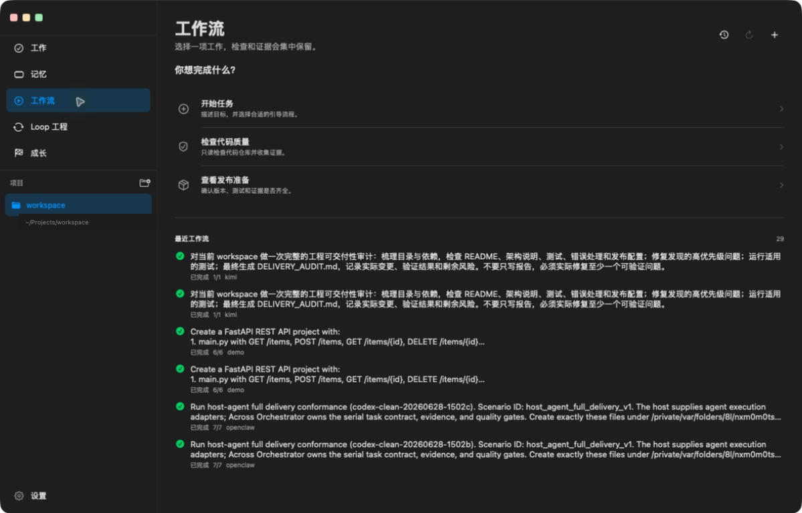
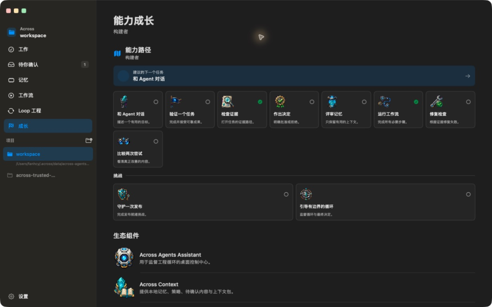

<h1 align="center">Across Agents Assistant</h1>

<p align="center">
  
</p>

<p align="center">
  <strong>Supervised engineering loops for coding agents.</strong>
</p>

<p align="center">
  A beginner-friendly macOS workspace for describing a result, letting agents
  work, and approving evidence-backed delivery.
</p>

<p align="center">
  <a href="https://github.com/fantasyce/across-agents-assistant/actions/workflows/quality.yml"></a>
  <a href="https://github.com/fantasyce/across-agents-assistant/actions/workflows/security.yml"></a>
  <a href="LICENSE"></a>
</p>

<p align="center">
  
</p>

## Start With One Result

Open a project, describe what you want, and review the delivery. Text, files,
images, and microphone input can all begin a task. Across keeps model routing,
retry details, and evidence machinery out of the way until they matter.

The recommended first workflow is **Repository Quality Copilot**. Open
**Workflows** in the app, or run:

```bash
across-autopilot loop run --spec repo-quality-copilot --json
```

It produces a readable repository report, structured evidence, release notes,
and optional memory suggestions for review.

## A Product That Grows With You

The base app remains useful on its own. First-party plugins add destinations
only after they are installed and healthy.

| Component | What it adds | Current release |
| --- | --- | --- |
| Across Agents Assistant | macOS workspace, approvals, settings, local permissions, and plugin lifecycle | `v0.12.1` |
| Across Context | shared memory, provenance, review, forgetting, and context packs | `v0.10.0` |
| Across Orchestrator | task execution, quality gates, safe replay, sandbox policy, and evidence receipts | `v0.9.0` |
| Across Autopilot | guided workflows, LoopSpec supervision, repair, and release readiness | `v0.4.0` |

Install or repair the three optional components from **Settings → Plugins**.
Packaged builds carry verified plugin payloads, so the one-click path does not
require the user to install Git, npm, Node, or Python.

## Product Tour

| Workflows | Loop Engineering |
| --- | --- |
|  |  |

| Growth | Plugin Center |
| --- | --- |
|  |  |

## What `v0.12.1` Includes

- Microphone-only, append-safe voice input with Chinese and English
  recognition, punctuation, and longer pause handling.
- Beginner-safe guided starts, visual result cards, and a deterministic no-key
  demo for learning the product before connecting a model.
- Ten learning missions, four progression levels, and twelve pixel-style
  achievement badges backed by real product activity.
- Human-readable role, model, budget, approval, and promotion policy.
- Tamper-evident receipts, safe replay, attempt comparison, governed memory
  provenance, and risk-aware sandbox status.
- Consistent borderless navigation, page spacing, detail layouts, project
  switching, Settings design, and double-click window maximize behavior.
- A corrected Human Review inspector label that never exposes an untranslated
  numeric format placeholder.

Full release history lives in [CHANGELOG.md](CHANGELOG.md).

## Trust Boundaries

Across is designed around human-approved delivery:

- Credentials, macOS permissions, raw approval decisions, and final promotion
  stay with the host app.
- Task execution and durable task state belong to Across Orchestrator.
- Shared memory and pending review belong to Across Context.
- Autonomous iteration stops at a reviewable promotion package by default.
- Normal product state stays under `~/.across`; packaged runtime does not import
  plugin implementation files from development checkouts.
- On systems without native filesystem isolation, restrictive read-only
  execution is blocked instead of being reported as enforced.

## Build From Source

Requirements:

- macOS 14 or newer
- Xcode command line tools
- Swift 5.10 or newer
- Python 3.10 through 3.13

Clone, build, install, and open the formal local app:

```bash
git clone git@github.com:fantasyce/across-agents-assistant.git
cd across-agents-assistant
bash scripts/build_and_run.sh
```

The canonical local app is:

```text
/Applications/Across Agents Assistant.app
```

Do not keep a second long-lived copy under `~/Applications`. Local runtime
data, model credentials, logs, databases, build products, and permissions must
stay outside Git.

This is currently a source-first open-source release. The repository does not
publish a notarized downloadable app. A source build is ad-hoc signed for local
use; Developer ID signing and notarization are separate distribution steps.

## Development Checks

Run the public repository and backend gates:

```bash
bash scripts/open_source_check.sh
PYTHONPATH=backend/src backend/.venv/bin/python -m pytest backend/tests --ignore=backend/tests/e2e -q
```

Run Swift checks:

```bash
bash scripts/run_swift_behavior_checks.sh
bash scripts/verify_swift_package_lock.sh
swift build --package-path macOS-Client --skip-update
swift test --package-path macOS-Client --skip-update
```

Live E2E requires a released external Orchestrator command:

```bash
ACROSS_AGENTS_ORCHESTRATOR_COMMAND=/path/to/across-orchestrator \
ACROSS_AGENTS_LIVE_E2E_EVIDENCE_PATH="$(mktemp /tmp/across-live-e2e.XXXXXX)" \
  bash scripts/run_live_e2e.sh all
```

The formal open-source sequence is producer-first:

1. Across Orchestrator
2. Across Context
3. Across Autopilot
4. Across Agents Assistant

See [OPEN_SOURCE_RELEASE_HANDBOOK.md](OPEN_SOURCE_RELEASE_HANDBOOK.md) for the
complete merge, CI, tag, Live E2E, rollback, and local-refresh procedure.

## Agent-Readable Entry Points

- [llms.txt](llms.txt) — compact product and workflow discovery
- [AGENTS.md](AGENTS.md) — repository guidance for coding agents
- [across.product.json](across.product.json) — machine-readable product map
- [examples/agent-tasks](examples/agent-tasks) — copyable workflow prompts

## Contributing

Use [Discussions](https://github.com/fantasyce/across-agents-assistant/discussions)
for questions and workflow ideas, and
[Issues](https://github.com/fantasyce/across-agents-assistant/issues/new/choose)
for reproducible bugs and scoped feature requests. Read
[CONTRIBUTING.md](CONTRIBUTING.md), [CODE_OF_CONDUCT.md](CODE_OF_CONDUCT.md),
and [SECURITY.md](SECURITY.md) before contributing or reporting a security
issue.

## License

Across Agents Assistant is licensed under the
[GNU Affero General Public License v3.0](LICENSE) (`AGPL-3.0-only`).
