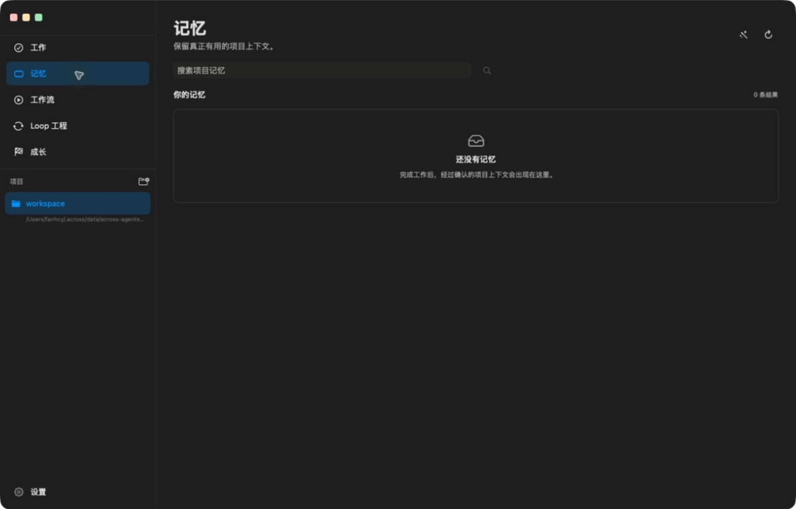

<h1 align="center">Across Agents Assistant</h1>

<p align="center">
  
</p>

<p align="center">
  <strong>Supervised engineering loops for coding agents.</strong>
</p>

<p align="center">
  <a href="https://github.com/fantasyce/across-agents-assistant/actions/workflows/quality.yml"></a>
  <a href="https://github.com/fantasyce/across-agents-assistant/actions/workflows/security.yml"></a>
  <a href="LICENSE"></a>
</p>

<p align="center">
  A simple macOS workspace for getting agent work done, then adding memory,
  quality workflows, and supervised engineering loops only when you need them.
</p>

<p align="center">
  
</p>

## Try This First

Across should be evaluated through a concrete workflow before its internal
modules. The recommended first run is Repository Quality Copilot:

In the desktop app, open **Workflows** and choose **Repository Quality
Copilot**. From a terminal, the same starting point is:

```bash
across-autopilot loop run --spec repo-quality-copilot --json
```

Expected output:

- markdown repository quality report
- JSON evidence artifact
- release/readiness checklist
- optional pending memory for Across Context review

Agent-readable entrypoints:

- [llms.txt](llms.txt) for model and agent product discovery
- [AGENTS.md](AGENTS.md) for coding-agent repository instructions
- [across.product.json](across.product.json) for machine-readable product
  classification
- [examples/agent-tasks](examples/agent-tasks) for copyable agent task
  templates

## Why It Exists

Most agent products expose their internal machinery and make users configure it
before useful work can begin. Across keeps the first experience small: open a
project, describe the result you want, and review the delivery.

The desktop app is also a host for optional Across capabilities. Installing
Context adds shared memory, Orchestrator adds quality-controlled workflows, and
Autopilot adds supervised Loop Engineering. The navigation grows with the
installed capabilities, while detailed evidence and policy stay available when
they are needed instead of dominating every task.

Routine work is zero-configuration: AAA discovers capability manifests, checks
health and trust, and selects one safe plan internally. It asks only when a
credential, material security choice, or external promotion really requires a
decision. Third-party capabilities can appear without adding navigation or
exposing provider and retry settings in the normal workflow.

## Loop Engineering Use Cases

Across is now packaged as a Loop Engineering workspace: a way to turn repeat
engineering chores into supervised agent loops with evidence, repair attempts,
and reusable memory.

Start with concrete workflows:

- **Repository Quality Copilot:** run a bounded repo health loop before releases
  or PR review.
- **Release Captain:** convert a release checklist into an evidence-backed
  readiness report.
- **Plugin Compatibility Lab:** evaluate external MCP or agent plugins before
  adding them to a team's workflow.
- **Autonomous Product Iteration:** let Across create a candidate workspace,
  validate the change, and stop with a human-review promotion package.

Start with **Plugin Compatibility Lab v2** when you want to test whether an MCP
server, coding-agent plugin, or agent tool is safe enough for a team workflow.
It turns the adoption decision into a workflow card, protocol-readiness matrix,
trust receipt, evidence graph, pending memory, A2A delegation envelope, and
OTel/OTLP-compatible trace export. See
[Plugin Compatibility Lab](examples/agent-tasks/plugin-compatibility-lab.md).

The product packaging, examples, and host-neutral install story are kept in
`README.md`, `llms.txt`, `across.product.json`, and the copyable tasks under
`examples/agent-tasks/`.

## Across Product Boundaries

The Across ecosystem is intentionally split into four independently releasable
products:

- **Across Agents Assistant** is the macOS host and control panel. It owns the
  Swift UI, local backend API, provider configuration, credentials, macOS
  permissions, local agent process discovery, tool approvals, task evidence
  views, and plugin lifecycle UI.
- **Across Context** is the shared-memory plugin. It owns memory search, memory
  write policy, pending review, MCP memory tools, and durable memory under
  `~/.across/data/across-context`. The host discovers it through
  `~/.across/bin/across-context` after a managed install under
  `~/.across/plugins/across-context`.
- **Across Orchestrator** is the task-runtime plugin. It owns task lifecycle,
  delivery contracts, dependency waves, Agent Loop checkpoints, quality gates,
  remediation behavior, evidence bundles, and durable task state under
  `~/.across/data/across-orchestrator`. The host discovers it through
  `~/.across/bin/across-orchestrator`.
- **Across Autopilot** is the LoopSpec supervision plugin. It owns trigger
  queues, candidate run supervision, host-session recovery, repair/retry
  evidence, release-readiness reports, and autonomous iteration guardrails under
  the managed `~/.across` plugin boundary.

The three core plugins are generic agent-host plugins, not AAA-only modules.
Codex, Claude Code, Claude Desktop, AAA, and
other CLI/MCP-capable hosts should consume them through pinned managed installs,
CLI, HTTP, MCP, plugin manifests, or host APIs. AAA product code must not import
or execute plugin implementation files from a development checkout such as
`~/Documents/projects/...`. Development checkouts are valid only as
user-selected project roots or explicit developer install source overrides.
Normal packaged-app runtime paths stay under `~/.across` so fresh installs do
not trigger macOS Documents permission prompts just because a plugin exists.

## Product Tour

The current interface uses one consistent, borderless desktop shell. Every
primary page starts with the same title rhythm, compact icon actions, and
project-aware navigation.

| Work | Memory |
| --- | --- |
|  |  |

| Workflows | Loop Engineering |
| --- | --- |
|  |  |

| Growth |
| --- |
|  |

## Recent Product Highlights

This README keeps only the current product shape. The full release chronology
lives in [CHANGELOG.md](CHANGELOG.md).

| Version | User-visible capability |
| --- | --- |
| `0.11.0` | Rebuilds the desktop experience around a minimal Work home, capability-based navigation, unified Memory, Workflows, and Loop Engineering pages, visual growth and achievements, and clearer review and delivery actions. |
| `0.10.0` | Adds isolated agent workspaces, anchored review, approval-controlled GitHub delivery, governed memory, and security-scoped repository access. |

## Core Capabilities

- A useful base app without optional plugins: project work, local/cloud agents,
  attachments, voice, session history, and scoped tools.
- Capability-driven navigation that adds Memory, Workflows, and Loop Engineering
  when their plugins are installed and healthy.
- Guided starts for Repository Quality Copilot, Plugin Compatibility Lab, and
  Release Captain without exposing orchestration internals up front.
- Delivery review with accept-once completion, in-place revision, task-specific
  technical evidence, and human-controlled promotion.
- Governed memory search, pending approval, one-click review, provenance, and
  forgetting through Across Context.
- Multi-agent execution, quality gates, evidence bundles, and repair through
  Across Orchestrator.
- Trigger supervision, candidate workspaces, health signals, and bounded repair
  through Across Autopilot.
- Local runtime state under `~/.across`, with credentials and approvals owned by
  the host.

## Local macOS Swiss Army Knife

Across Agents Assistant is not just a model launcher. Its local backend can connect agent work to the Mac around it, with explicit permission controls:

- Draft email in Mail without sending it automatically.
- Draft notes in Notes.
- Read Finder selection and folder context.
- Read the active Xcode document path.
- Inspect browser URL/title context when enabled.
- Read image text and screenshot text through OCR.
- Search, list, read, write, and edit scoped local files.
- Adjust simple system utilities such as volume or appearance when approved.
- Extend context through MCP servers for knowledge bases, SQLite, filesystem access, and external retrieval.

## Current Status

This project is under active development. The current release is `0.11.0` and
source-first: the repository is intended for local building and inspection, not
notarized binary distribution. See [CHANGELOG.md](CHANGELOG.md) for detailed
release notes.

Current managed producer pins:

- Across Autopilot `v0.3.0`
- Across Orchestrator `v0.8.0`
- Across Context `v0.9.0`

The current release replaces the dense Operations Workbench shell with a
minimal project-first experience. Optional plugin capabilities appear as clear
destinations, review actions stay close to the item being reviewed, and
advanced evidence remains available without becoming the default interface.
Loop Engineering keeps activity-aware idle timeouts, bounded wall-time limits,
candidate isolation, managed source mirrors, and human-reviewed promotion.

The formal local A app is `/Applications/Across Agents Assistant.app`. Local
development and release validation should refresh that app through
`bash scripts/build_and_run.sh`; do not keep duplicate long-lived AAA app copies
in `~/Applications`. Candidate B app lifecycle checks install temporary app
bundles under
`~/.across/data/across-autopilot/candidate-apps/<candidate_id>/` with isolated
runtime homes. Candidate workspaces and app artifacts are lifecycle-managed, with
only the latest two candidate artifact sets retained by default.

AAA remains the host UI and policy surface. It uses plugin manifests, wrappers,
HTTP, CLI, MCP, or host APIs; product code must not import implementation files
from Autopilot, Orchestrator, or Context development checkouts.

Operational references:

- [Open Source Release Handbook](OPEN_SOURCE_RELEASE_HANDBOOK.md) records the
  producer-first release flow, validation gates, Live E2E, tagging, and
  rollback path.
- [AGENTS.md](AGENTS.md), `llms.txt`, and `across.product.json` are the
  agent-readable product entrypoints.
- `examples/agent-tasks/` contains the copyable workflow tasks for Repository
  Quality Copilot, Release Captain, and Plugin Compatibility Lab.

## Quick Start

Clone the repository:

```bash
git clone git@github.com:fantasyce/across-agents-assistant.git
cd across-agents-assistant
```

Build and launch the current local macOS app:

```bash
bash scripts/build_and_run.sh
```

This stops old AAA app/backend processes, builds the app bundle, installs the
fresh bundle to `/Applications/Across Agents Assistant.app`, and opens that app.
This is the canonical path for local development and release validation.

For build-only troubleshooting, build the local macOS app bundle:

```bash
bash build_app.sh
```

The default packaging mode uses an unpacked backend bundle for faster app startup. For troubleshooting only, you can compare the older single-file backend mode:

```bash
BACKEND_BUNDLE_MODE=onefile bash build_app.sh
```

Open the app from the generated bundle:

```bash
open -n "build/Across Agents Assistant.app"
```

On first launch:

- Open Settings -> Diagnostics to confirm backend health, local runtime paths,
  provider readiness, and task persistence.
- Open Model Settings.
- Configure at least one cloud LLM API key, or install/configure one local agent.
- Supported local agent integrations currently include OpenClaw, Hermes, Claude
  Code, Claude Desktop, Codex, Kimi Code, OpenCode, and Cursor Agent.
- Open Agent Capabilities to tune each agent's built-in/custom skills, install or inspect native local-agent skills, configure MCP plugins, set tool scope, and add task-specific operating notes.
- Native skills that fail readiness checks are shown as unavailable with the missing requirement, and are excluded from automatic capability routing until repaired.
- Open Workflows and start with Repository Quality Copilot, Plugin
  Compatibility Lab, or Release Captain. The generated task draft stays editable
  before submission.
- For expert tasks, review Capability Preflight before submitting; it previews
  the recommended agent and matching skills.
- Grant macOS permissions only when you need the related feature, such as microphone, screen capture, Apple Events, or file access.

Local runtime state is stored under `~/.across`. Build outputs, local credentials, logs, databases, certificates, and model files should stay outside Git.

## Requirements

- macOS 14 or newer
- Xcode command line tools
- Swift 5.10 or newer
- Python 3.10 or newer

Optional integrations may require local CLI agents, provider API keys, MCP server configuration, or user-granted macOS permissions.

## Build From Source

```bash
bash build_app.sh
```

The script creates a local development app bundle at:

```text
build/Across Agents Assistant.app
```

By default, the bundle is ad-hoc signed and is not a distributable DMG. Newer macOS versions may require a trusted signing identity before opening a packaged GUI app through LaunchServices. For future binary distribution, provide a real signing identity through `SIGNING_IDENTITY`, then complete Developer ID signing, hardened runtime, and notarization outside the public Git tree.

## Backend Development

```bash
cd backend
python3 -m venv .venv
source .venv/bin/activate
pip install -r requirements.txt
PYTHONPATH=src python3 -m pytest tests --ignore=tests/e2e -q
```

### Delivery Quality Benchmark

After a complex task completes, the backend can turn the task's delivery report
into a release-quality benchmark result. This is useful for comparing versions
with the same task prompt and acceptance thresholds.

```bash
curl --unix-socket "$HOME/.across/run/across-agents-assistant/across-agents.sock" \
  "http://backend/api/tasks/<task-id>/quality-benchmark?expected_files=index.html,styles.css,app.js,README.md&required_probes=static_web_smoke,browser_e2e&min_quality_score=70"
```

The benchmark fails if required probes fail, expected files drift, the quality
gate is not passed, required checks are skipped, active remediation remains, or
the final score falls below the requested threshold.

For a broader release audit, export the task evidence bundle. It is read-only,
redacts credential-shaped values, includes the delivery contract, requirement
manifest, owner decision, quality health, artifacts, acceptance records, and a
benchmark result in one local JSON payload:

```bash
curl --unix-socket "$HOME/.across/run/across-agents-assistant/across-agents.sock" \
  "http://backend/api/tasks/<task-id>/evidence-bundle?expected_files=index.html,styles.css,app.js,README.md&required_probes=static_web_smoke,browser_e2e&min_quality_score=70"
```

Agent capability cards can also be exported without secrets:

```bash
curl --unix-socket "$HOME/.across/run/across-agents-assistant/across-agents.sock" \
  "http://backend/api/agent-cards"
```

Startup diagnostics can be checked from the packaged app or from the socket:

```bash
curl --unix-socket "$HOME/.across/run/across-agents-assistant/across-agents.sock" \
  "http://backend/api/diagnostics/startup"
```

### Across Orchestrator Runtime Slot

Task orchestration is hosted by an external Across Orchestrator product. The
desktop app is the console and plugin host; it does not silently fall back to
any in-app task runtime in normal product mode. If the plugin is not
installed or connected, the task orchestration entry is shown as unavailable
with a one-click install action.

```bash
ACROSS_AGENTS_ORCHESTRATOR_MODE=external    # default and only supported product mode
ACROSS_AGENTS_ORCHESTRATOR_ENDPOINT=http://127.0.0.1:8765
ACROSS_AGENTS_ORCHESTRATOR_COMMAND=across-orchestrator
ACROSS_AGENTS_ORCHESTRATOR_PLUGIN_HOME="$HOME/.across/plugins"
# Development/source-build fallbacks; packaged builds use signed-in-app payloads.
ACROSS_AGENTS_ORCHESTRATOR_INSTALL_SOURCE=git+https://github.com/fantasyce/across-orchestrator.git@v0.8.0
ACROSS_AGENTS_AUTOPILOT_INSTALL_SOURCE=git+https://github.com/fantasyce/across-autopilot.git#v0.3.0
ACROSS_AGENTS_ORCHESTRATOR_PYTHON=/opt/homebrew/bin/python3
ACROSS_AGENTS_ORCHESTRATOR_AUTORUN=1
ACROSS_AGENTS_CONTEXT_INSTALL_SOURCE=git+https://github.com/fantasyce/across-context.git#v0.9.0
ACROSS_ORCHESTRATOR_MEMORY_PROVIDER=across-context
ACROSS_CONTEXT_COMMAND="$HOME/.across/bin/across-context"
```

In packaged or product mode, set `ACROSS_AGENTS_PRODUCT_MODE=1`. Protected
runtime overrides such as `ACROSS_HOME`, `ACROSS_PLUGIN_HOME`,
`ACROSS_BIN_HOME`, `ACROSS_CONTEXT_COMMAND`, and
`ACROSS_AGENTS_BACKEND_DIR` are ignored when they point under user project
locations such as `~/Documents`, `~/Desktop`, or `~/Downloads`; the host uses
the managed `~/.across` runtime instead. The same rule applies to
`ACROSS_AGENTS_HOME`, `ACROSS_AGENTS_DB_PATH`, plugin install-source overrides,
`ACROSS_CONTEXT_HOME`, and `ACROSS_ORCHESTRATOR_HOME`. Product diagnostics and
MCP auto-connect also ignore protected `across-context` or
`across-orchestrator` commands found through `PATH` instead of reading or
executing those wrappers. Source checkout paths are accepted only when
`ACROSS_AGENTS_DEVELOPER_MODE=1` or
`ACROSS_AGENTS_ALLOW_DEVELOPMENT_RUNTIME_PATHS=1` is set intentionally. The
same boundary is applied when plugin child environments carry
`ACROSS_CONTEXT_PRODUCT_MODE=1` or `ACROSS_ORCHESTRATOR_PRODUCT_MODE=1`.

When an endpoint is configured, the app talks to that external HTTP runtime. If
no endpoint is configured, it discovers the wrapper at
`~/.across/bin/across-orchestrator`, starts a local sidecar with
`across-orchestrator serve --host 127.0.0.1 --port 0`, and reads runtime
metadata from `~/.across/run/across-orchestrator`. The UI calls
the plugin lifecycle API to copy the verified, self-contained Orchestrator
executable into `~/.across/plugins/across-orchestrator`. The configured source
and Python virtualenv path remain a development/source-build fallback.

Packaged builds include everything required by the three first-party plugins:
a fixed Node runtime, verified Context and Autopilot source archives, and a
self-contained Orchestrator executable. Plugin Center installation therefore
does not require npm, Git, Node, or Python to be preinstalled on the user's
Mac. Source builds without these bundled payloads retain the previous npm and
Python installer paths for development. The AAA backend source runtime remains
Python `>=3.10,<3.14`.

External task state stays in `~/.across/data/across-orchestrator`; the app only
keeps a thin task-id index in
`~/.across/data/across-agents-assistant/orchestrator-plugin/tasks.json` so the
main task UI can show external tasks.

### Across Context Memory Plugin

Shared memory is hosted by the external Across Context product. The desktop app
owns the Plugin Center, memory review surfaces, and host permissions; Across
Context owns memory policy, CLI/MCP tools, pending write review, and durable
vault files.

Managed installs place runtime code under
`~/.across/plugins/across-context`, create the wrapper at
`~/.across/bin/across-context`, and keep durable memory under
`~/.across/data/across-context`. The packaged app should discover and repair
that managed runtime using its bundled Node executable instead of pointing at
`npm link`, a source checkout, or a path under `~/Documents/projects`. Across
Autopilot follows the same managed runtime contract. Uninstall removes plugin
runtime code and wrappers while preserving each component's durable data under
`~/.across/data`.

AAA no longer packages an in-app task orchestration runtime. Task execution,
loop state, checkpoints, remediation, and final evidence are owned by the
external Across Orchestrator plugin; AAA keeps only host UI, API projection, and
read-only evidence views for task records.

External Release E2E evidence is accepted only when the app-grade benchmark
passes artifact integrity, workspace hygiene, security/privacy, agent mix,
static web smoke, browser E2E, API service, and CLI gates. The focused backend
check is:

```bash
PYTHONPATH=backend/src pytest \
  backend/tests/test_orchestrator_plugin.py \
  backend/tests/test_api_orchestrator_plugin.py \
  backend/tests/test_api_release_e2e.py \
  backend/tests/test_api_startup_diagnostics.py \
  -q
```

Live E2E can be run against a temporary AAA backend and an external
Across Orchestrator command without touching the packaged app socket:

```bash
ACROSS_AGENTS_ORCHESTRATOR_COMMAND=/path/to/across-orchestrator \
  bash scripts/run_live_e2e.sh all
```

The script creates temporary `ACROSS_HOME` and `ACROSS_AGENTS_HOME` roots,
starts the backend on a temporary Unix socket, runs
`backend/tests/e2e/run_e2e.py`, and then runs the legacy socket-backed
`backend/tests/e2e/test_api_e2e.py` with `ACROSS_AGENTS_RUN_LIVE_E2E=1`.
It writes a non-secret gate evidence JSON file to
`$HOME/.across/data/across-agents-assistant/release-reports/` by default; set
`ACROSS_AGENTS_LIVE_E2E_EVIDENCE_PATH` to store it elsewhere. Remove
`$HOME/.across/data/across-agents-assistant/release-reports/*-gate-evidence.json`
to clear stale local gate evidence.
Other pre-release gates use the same non-secret evidence contract. After a
local gate passes, write evidence with:

```bash
bash scripts/write_pre_release_gate_evidence.sh open_source_check passed local_script
bash scripts/write_pre_release_gate_evidence.sh backend_regression passed local_script
bash scripts/write_pre_release_gate_evidence.sh swift_behavior_checks passed local_script
bash scripts/write_pre_release_gate_evidence.sh swift_package_gate passed local_script
```

Or run all local pre-release gates and write evidence in one pass:

```bash
bash scripts/run_pre_release_local_gates.sh
```

The packaged app reads these files from
`$HOME/.across/data/across-agents-assistant/release-reports/`. It does not need
or use a development checkout path to verify attached release evidence.
The GitHub `Live E2E` workflow exposes the same runner as a manual
`workflow_dispatch` job and installs Across Orchestrator `v0.8.0` before
running it. The workflow uploads `live-e2e-gate-evidence` as a run artifact.
Run the GitHub `Live E2E` workflow with `tier=all` before approving a release,
and keep the workflow run URL with the release evidence. The evidence JSON
records the run URL when the workflow provides GitHub Actions run metadata.

RC verification can be run from Settings -> Diagnostics or through the packaged app backend. It writes non-secret JSON and Markdown reports to `$HOME/.across/data/across-agents-assistant/release-reports/`:

```bash
curl --request POST --unix-socket "$HOME/.across/run/across-agents-assistant/across-agents.sock" \
  "http://backend/api/release/verification"
```

The HTTP response is a fixed public DTO with status, counts, and bounded
readiness summaries. Detailed task IDs, command output, evidence paths, run
URLs, and diagnostics stay in the local JSON/Markdown reports so release
verification remains useful without exposing stack traces or local machine
details through the API boundary.

When changing startup, task orchestration, delivery contracts, capability routing, native skills, MCP safety, or release evaluation, also run the focused tests for the touched area and verify the packaged app path before considering the change release-ready.

## Open-Source Quality Checks

Run the public repository guard locally before publishing changes:

```bash
bash scripts/open_source_check.sh
```

The check verifies whitespace, forbidden tracked artifacts, common secret patterns, README image assets, and shell syntax for `build_app.sh` plus every script under `scripts/`. GitHub Actions also runs the open-source check, backend regression tests, Swift build, and Swift behavior checks on pushes to `main` and pull requests.

GitHub security automation is also enabled:

- The Security workflow runs CodeQL for the Python backend on pull requests, pushes to `main`, scheduled weekly runs, and manual dispatches. The Quality workflow separately verifies the Swift macOS client build and standalone behavior checks.
- The Live E2E workflow is manual because it starts an external Across Orchestrator runtime and runs task scenarios that should not be silently skipped in public PR CI.
- Dependabot monitors GitHub Actions, Python requirements, and Swift Package Manager dependencies.
- Repository secret scanning and push protection are enabled for the public repository.

## macOS Client Development

```bash
cd macOS-Client
swift build -c release --force-resolved-versions --skip-update
bash ../scripts/run_swift_behavior_checks.sh
```

## Configuration And Secrets

Do not commit API keys, local runtime data, build outputs, app databases, logs, screenshots with private content, local model files, certificates, notarization credentials, or machine-specific paths.

Provider credentials should be configured through the app, environment variables, Keychain, or another local ignored configuration path.

Optional MOSS-TTS integration is controlled by:

- `MOSS_TTS_PATH`
- `MOSS_TTS_MODEL_DIR`

If these variables are not set, the TTS service falls back to Edge-TTS when available.

## License and IP

Project-owned source code is licensed under the GNU Affero General Public
License v3.0. The intended SPDX expression is `AGPL-3.0-only`.

The AGPLv3 permits commercial use, but modified covered versions must provide
corresponding source when the license requires it, including for remote network
interaction. Proprietary closed-source use requires a separate commercial
license from the rights holder.

See `legal/IP_AND_LICENSE_POLICY.md`, `legal/CONTRIBUTOR_CERTIFICATE.md`,
`legal/THIRD_PARTY_NOTICES.md`, and `CODE_OF_CONDUCT.md` for contribution
certification, dependency notices, release review policy, and community
expectations.

## Contributing

Community channels are open:

- [Discussions](https://github.com/fantasyce/across-agents-assistant/discussions) for questions, troubleshooting, workflows, and early ideas.
- [Issues](https://github.com/fantasyce/across-agents-assistant/issues/new/choose) for reproducible bugs, scoped feature requests, and concrete product feedback.

See [CONTRIBUTING.md](CONTRIBUTING.md) and
[CODE_OF_CONDUCT.md](CODE_OF_CONDUCT.md) before contributing code or opening long-form feedback.

Security reporting guidance is in [SECURITY.md](SECURITY.md).

## License

This project is licensed under the [GNU Affero General Public License v3.0](LICENSE).

Project names, logos, app icons, and official release branding are governed by the [Trademark Policy](legal/TRADEMARK_POLICY.md). Third-party agent and provider names are used only to describe compatibility.

See [NOTICE](NOTICE) for copyright and attribution notes.
