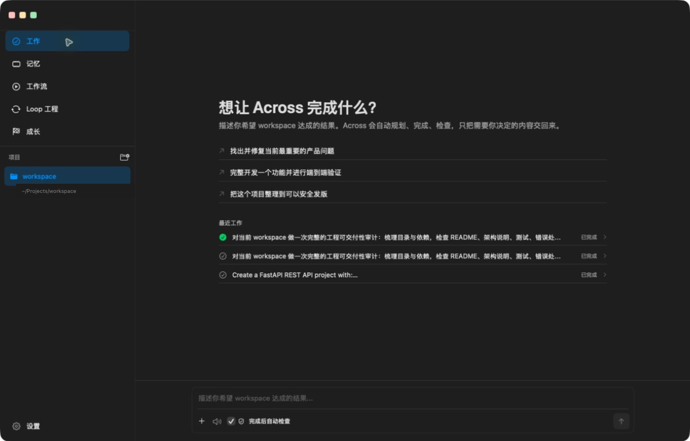
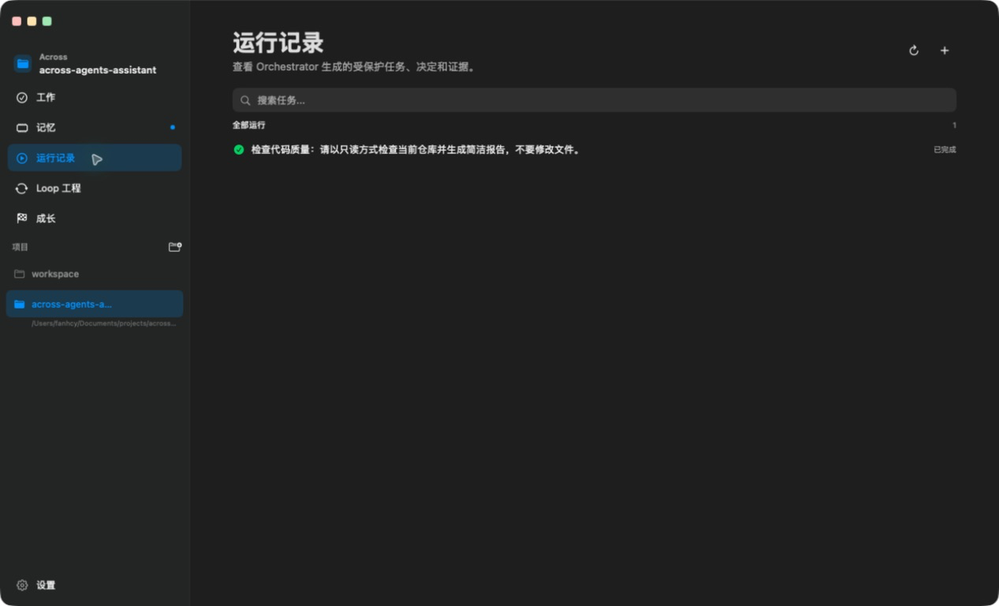
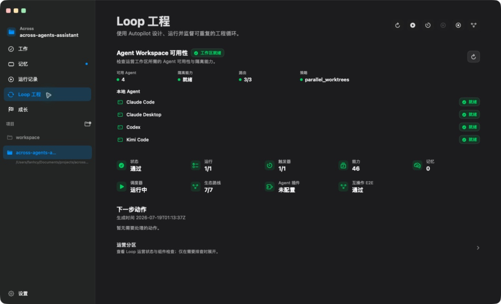
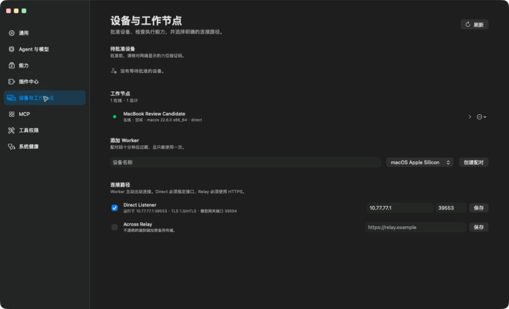
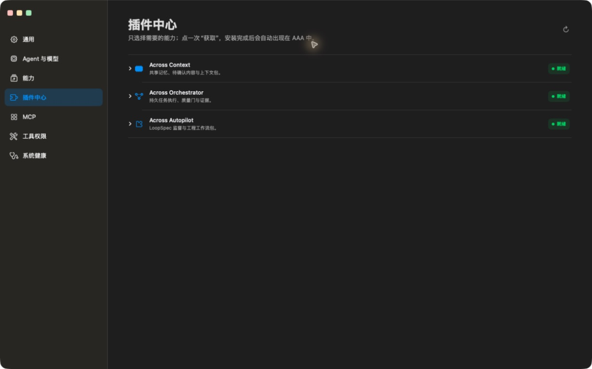

<h1 align="center">Across Agents Assistant</h1>

<p align="center">
  
</p>

<p align="center">
  <strong>Supervised engineering loops for coding agents.</strong>
</p>

<p align="center">
  A beginner-friendly macOS workspace for describing a result, letting agents
  work, and approving evidence-backed delivery.
</p>

<p align="center">
  <a href="https://github.com/fantasyce/across-agents-assistant/actions/workflows/quality.yml"></a>
  <a href="https://github.com/fantasyce/across-agents-assistant/actions/workflows/security.yml"></a>
  <a href="LICENSE"></a>
</p>

<p align="center">
  
</p>

## Start With One Result

Open a project and describe the result you want. Text, files, images, and
microphone input all use the same **Work** entry. Across keeps workflow choice,
model routing, retries, and evidence machinery out of the way until they matter.
If Autopilot is installed, it can resolve the goal to one compatible workflow;
otherwise the task stays an ordinary host task. Scenario simulation is one
optional workflow selected from task intent, not a permanent AAA task type.

The recommended first task is **Repository Quality Copilot**. Enter a repository
quality goal in Work, or run:

```bash
across-autopilot loop run --spec repo-quality-copilot --json
```

It produces a readable repository report, structured evidence, release notes,
and optional memory suggestions for review.

## A Product That Grows With You

The base app opens projects, accepts text or voice goals, discovers configured
local agents and models, manages permissions, and provides a deterministic
no-key learning path. First-party plugins add durable execution, memory, and
supervised workflow capabilities only after they are installed and healthy.

| Component | What it adds | Current release |
| --- | --- | --- |
| Across Agents Assistant | macOS workspace, generic task entry, approvals, devices, settings, and plugin lifecycle | `v0.14.5` |
| Across Context | shared memory, provenance, review, forgetting, context packs, and governed Worker experience | `v0.11.1` |
| Across Orchestrator | task execution, remote Workers, quality gates, sandbox policy, and evidence receipts | `v0.10.11` |
| Across Autopilot | goal-driven workflow resolution, LoopSpec supervision, repair, and release readiness | `v0.5.3` |

Install or repair the three optional components from **Settings → Plugins**.
Packaged builds carry verified plugin payloads, so the one-click path does not
require the user to install Git, npm, Node, or Python.

## Product Tour

| Run History | Loop Engineering |
| --- | --- |
|  |  |

| Devices & Workers | Plugin Center |
| --- | --- |
|  |  |

## What `v0.14.5` Includes

- Eligible read-only, low-risk host MCP tools can now be exposed to local task
  agents through a private task-scoped bridge, including direct Agent runs and
  Orchestrator-managed work.
- The bridge fails closed: it filters tools by policy, validates task
  ownership and lifecycle, preserves byte-transparent MCP traffic, and cleans
  up private local proxy paths when the task ends.
- Reproducible formal builds now bundle Orchestrator `v0.10.11`, which keeps
  read-only task reports in Orchestrator-owned storage instead of writing into
  the inspected project, while preserving the same host-facing task contract.
- The bundled Orchestrator version remains aligned across the payload,
  declared by the host install source, source mirror, Live E2E workflow, and
  Worker catalog.
- Context remains at `v0.11.1` and Autopilot at `v0.5.3`; neither producer
  required a code change for this release.

### Previous `v0.14.3` release

- Managed Orchestrator integration now uses `v0.10.10` across the bundled
  payload, install source, source mirror, Live E2E workflow, and verified
  Worker release catalog.
- Context remains at `v0.11.1` and Autopilot at `v0.5.3`; neither producer had
  code changes that would justify an empty release.

- Source-only acceptance now reuses its prepared backend environment and
  reports packaged-plugin provenance as an explicit installed-App boundary,
  while retaining mandatory compatibility verification for packaged runs.
- Clean-checkout release acceptance now bootstraps the AAA and Orchestrator
  Python environments before any dependent gate and accepts standard Git
  worktrees as valid repositories.
- Managed producer pins advance to Context `v0.11.1` and Orchestrator
  `v0.10.10`, whose acceptance fixtures no longer depend on calendar time or
  repository checkout location.

- An immutable, content-addressed promotion package that binds the complete run,
  task set, verified receipts, plugin provenance, compatibility evidence, and
  release readiness before a separate human approval can authorize promotion.
- Atomic managed-plugin lifecycle transactions for Context, Orchestrator, and
  Autopilot, including dependent-runtime drain, reconnect, rollback, and
  provenance verification across repair, upgrade, uninstall, and failure paths.
- Portable MCP compatibility validation and raw-receipt verification before
  redaction, with fail-closed task-set, approval-chain, and compatibility
  contracts that do not trust caller-supplied evidence.
- Updated managed producer pins for Context `v0.11.1`, Orchestrator `v0.10.10`,
  and Autopilot `v0.5.3`.

- One generic Work entry with goal-driven Autopilot resolution; starter cards
  and scenario-specific host fields no longer define the task model.
- Approved remote macOS or Linux Workers over direct IP links, including LAN or
  point-to-point connections, plus an optional public relay path when direct
  reachability is unavailable.
- Expiring enrollment, mutual TLS, device revocation, resource leases,
  cancellation, bounded model grants, signed artifacts, and local evidence
  verification without copying host model credentials to the Worker.
- A unified Run History and a compact review surface with one result verdict,
  progressive evidence disclosure, and explicit accept or revision actions.
- A faster cached Loop Engineering snapshot, actionable checks, global
  achievements, configured-agent-only capability views, and the current
  borderless Apple-style page hierarchy.
- Managed plugin install, repair, upgrade, rollback, and uninstall coverage for
  all three first-party plugins, including runtime reconnect and provenance
  verification after a formal app rebuild.
- Packaged Autopilot now delegates Orchestrator work through the host-owned
  private socket, avoiding nested packaged-process startup limits while keeping
  the standalone CLI fallback. Completed runs retain Orchestrator and Context
  identifiers so the app can trace one goal across planning, execution, memory,
  and review.
- Live Worker cards now follow the authenticated capability manifest after an
  in-place update, and formal rebuilds reclaim any stale AAA-owned Worker
  network child before replacing managed plugin payloads.

Full release history lives in [CHANGELOG.md](CHANGELOG.md).

## Trust Boundaries

Across is designed around human-approved delivery:

- Credentials, macOS permissions, raw approval decisions, and final promotion
  stay with the host app.
- Task execution and durable task state belong to Across Orchestrator.
- Shared memory and pending review belong to Across Context.
- Autonomous iteration stops at a reviewable promotion package by default.
- Normal product state stays under `~/.across`; packaged runtime does not import
  plugin implementation files from development checkouts.
- On systems without native filesystem isolation, restrictive read-only
  execution is blocked instead of being reported as enforced.

## Build From Source

Requirements:

- macOS 14 or newer
- Xcode command line tools
- Swift 5.10 or newer
- Python 3.10 through 3.13

Clone, build, install, and open the formal local app:

```bash
git clone git@github.com:fantasyce/across-agents-assistant.git
cd across-agents-assistant
bash scripts/build_and_run.sh
```

The canonical local app is:

```text
/Applications/Across Agents Assistant.app
```

Do not keep a second long-lived copy under `~/Applications`. Local runtime
data, model credentials, logs, databases, build products, and permissions must
stay outside Git.

This is currently a source-first open-source release. The repository does not
publish a notarized downloadable app. A source build is ad-hoc signed for local
use; Developer ID signing and notarization are separate distribution steps.
The AAA app also does not currently provide in-app update checks or one-click
self-update. Developer ID distribution, Apple notarization, and AAA app
self-update are intentionally deferred until the project owner approves that
distribution investment. Managed plugin install, update, repair, and uninstall
remain supported inside AAA and do not depend on this deferred app-distribution
work.

## Development Checks

Run the public repository and backend gates:

```bash
bash scripts/open_source_check.sh
PYTHONPATH=backend/src backend/.venv/bin/python -m pytest backend/tests --ignore=backend/tests/e2e -q
```

Run Swift checks:

```bash
bash scripts/run_swift_behavior_checks.sh
bash scripts/verify_swift_package_lock.sh
swift build --package-path macOS-Client --skip-update
swift test --package-path macOS-Client --skip-update
```

Live E2E requires a released external Orchestrator command:

```bash
ACROSS_AGENTS_ORCHESTRATOR_COMMAND=/path/to/across-orchestrator \
ACROSS_AGENTS_LIVE_E2E_EVIDENCE_PATH="$(mktemp /tmp/across-live-e2e.XXXXXX)" \
  bash scripts/run_live_e2e.sh all
```

The formal open-source sequence is producer-first:

1. Across Orchestrator
2. Across Context
3. Across Autopilot
4. Across Agents Assistant

See [OPEN_SOURCE_RELEASE_HANDBOOK.md](OPEN_SOURCE_RELEASE_HANDBOOK.md) for the
complete merge, CI, tag, Live E2E, rollback, and local-refresh procedure.

## Agent-Readable Entry Points

- [llms.txt](llms.txt) — compact product and workflow discovery
- [AGENTS.md](AGENTS.md) — repository guidance for coding agents
- [across.product.json](across.product.json) — machine-readable product map
- [examples/agent-tasks](examples/agent-tasks) — copyable workflow prompts

## Contributing

Use [Discussions](https://github.com/fantasyce/across-agents-assistant/discussions)
for questions and workflow ideas, and
[Issues](https://github.com/fantasyce/across-agents-assistant/issues/new/choose)
for reproducible bugs and scoped feature requests. Read
[CONTRIBUTING.md](CONTRIBUTING.md), [CODE_OF_CONDUCT.md](CODE_OF_CONDUCT.md),
and [SECURITY.md](SECURITY.md) before contributing or reporting a security
issue.

## License

Across Agents Assistant is licensed under the
[GNU Affero General Public License v3.0](LICENSE) (`AGPL-3.0-only`).
