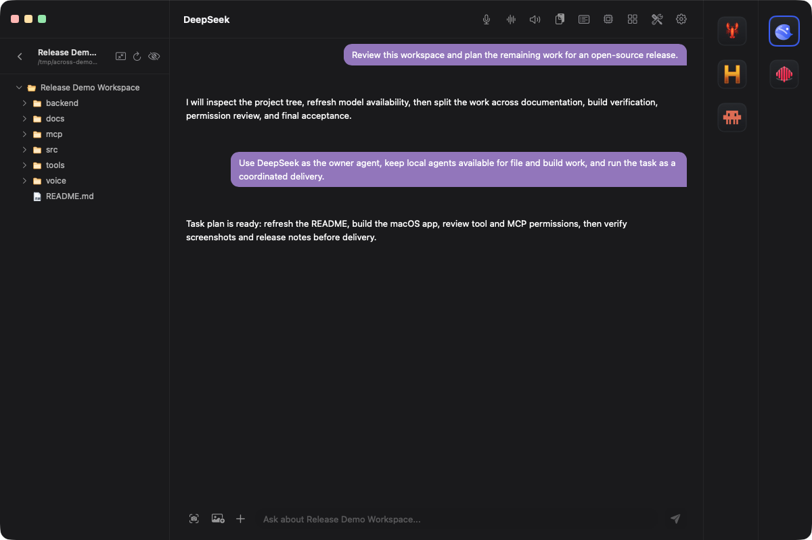
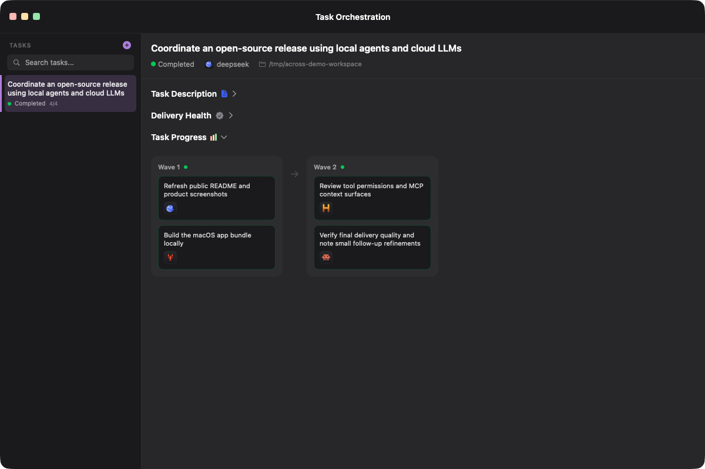
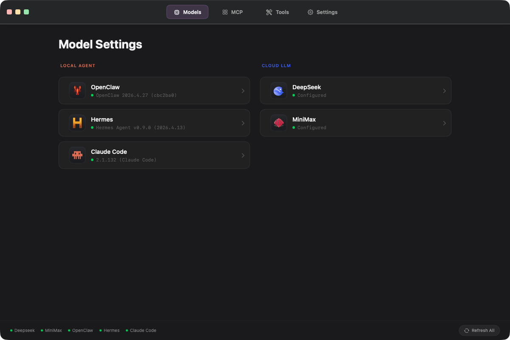
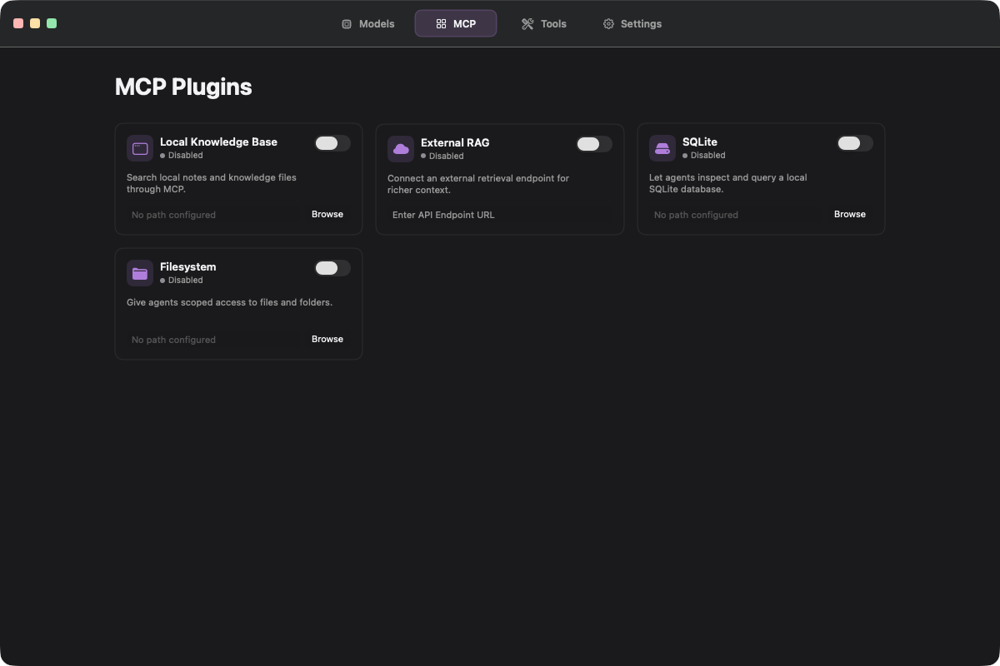
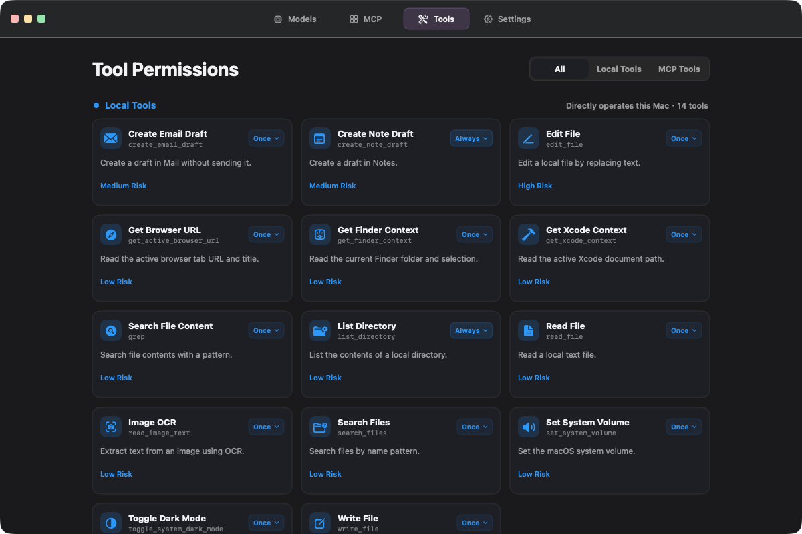
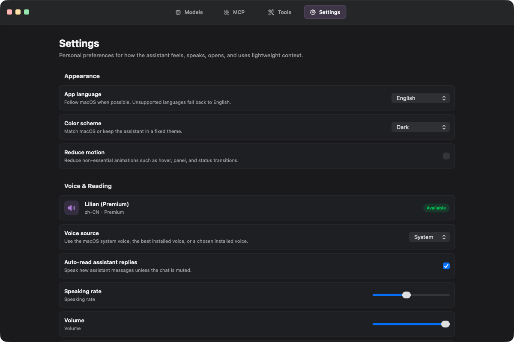

<h1 align="center">Across Agents Assistant</h1>

<p align="center">
  
</p>

<p align="center">
  <strong>A local-first macOS workspace for cross-agent collaboration.</strong>
</p>

<p align="center">
  Coordinate local coding agents and cloud LLMs from one native desktop app, keep work tied to a project tree, approve tools explicitly, and review complex task delivery before it leaves your machine.
</p>

<p align="center">
  
</p>

<p align="center">
  
</p>

<p align="center">
  
</p>

## Why It Exists

Across Agents Assistant is built for developers who want more than a single chat box. It brings local agents, cloud LLMs, project chat, voice, MCP context, tool permissions, and owner-led task orchestration into one macOS workbench.

The core idea is cross-agent collaboration: pick an owner agent, keep local agents and cloud LLMs visible, break a complex request into waves, and inspect the final delivery. You can also choose a single agent for a focused complex task. Delivery quality is designed to be strong and reviewable, while still acknowledging that some generated artifacts may occasionally need small human refinements.

## Product Tour

### Dark English Theme

The primary product experience uses the dark English theme.

| Project chat | Task orchestration |
| --- | --- |
|  |  |

| Complex task creation |
| --- |
|  |

| Models | MCP plugins |
| --- | --- |
|  |  |

| Tool permissions | Voice and preferences |
| --- | --- |
|  |  |

### Light Chinese Theme

The app also includes a light Simplified Chinese interface.

| 项目对话 | 任务编排 |
| --- | --- |
|  |  |

| 模型 | MCP 插件 |
| --- | --- |
|  |  |

| 工具权限 | 设置 |
| --- | --- |
|  |  |

## Core Capabilities

- Cross-agent task orchestration with an owner agent, subtask agents, waves, status tracking, delivery health, and acceptance-oriented review.
- Per-agent capability profiles for tuning built-in skills, custom skills, native local-agent skills, MCP plugin scope, tool scope, and execution instructions before tasks are decomposed.
- Native skill management for local agents: create directory-based Claude Code skills, inspect installed OpenClaw/Hermes skills, and use each agent's own skill commands for install, update, and validation where supported.
- Native skill readiness checks mark missing binaries, environment variables, or config as unavailable; unavailable native skills stay visible for repair but are not used as strong routing signals.
- Task capability preflight that recommends the best-fit agent mix before submission and shows which skills matched the request.
- Delivery quality gates for exact file contracts, workspace hygiene, runnable probes, and static web feature evidence when UI behavior is requested.
- Unified model surface for local agents such as OpenClaw, Hermes, and Claude Code, plus cloud LLMs such as DeepSeek and MiniMax.
- Project-scoped chat with a real directory tree, session history, file attachments, screenshots, and context-aware prompts.
- Single-agent mode for sending a complex task to one chosen agent when collaboration is unnecessary.
- Voice and continuous conversation features that let you talk through work, auto-read assistant replies, and reduce keyboard time.
- Local tool approval for file search/read/write/edit, browser URL context, Finder context, Xcode context, image OCR, screenshot OCR, Mail drafts, Notes drafts, system volume, dark mode, and MCP-backed tools.
- MCP plugin settings for local knowledge, external retrieval, SQLite, and filesystem context.
- Local runtime state under `~/.across_agents`, kept outside the source tree.

## Local macOS Swiss Army Knife

Across Agents Assistant is not just a model launcher. Its local backend can connect agent work to the Mac around it, with explicit permission controls:

- Draft email in Mail without sending it automatically.
- Draft notes in Notes.
- Read Finder selection and folder context.
- Read the active Xcode document path.
- Inspect browser URL/title context when enabled.
- Read image text and screenshot text through OCR.
- Search, list, read, write, and edit scoped local files.
- Adjust simple system utilities such as volume or appearance when approved.
- Extend context through MCP servers for knowledge bases, SQLite, filesystem access, and external retrieval.

## Current Status

This project is under active development. More local agents, more cloud LLMs, stronger delivery validation, richer tool integrations, and additional product workflows are planned. The current release is source-first: the repository is intended for local building and inspection, not notarized binary distribution.

## Quick Start

Clone the repository:

```bash
git clone git@github.com:fantasyce/across-agents-assistant.git
cd across-agents-assistant
```

Build the local macOS app bundle:

```bash
bash build_app.sh
```

Open the app from the generated bundle:

```bash
open -n "build/Across Agents Assistant.app"
```

Optional: install the locally built app into Applications:

```bash
rm -rf "/Applications/Across Agents Assistant.app"
ditto "build/Across Agents Assistant.app" "/Applications/Across Agents Assistant.app"
open -n "/Applications/Across Agents Assistant.app"
```

On first launch:

- Open Model Settings.
- Configure at least one cloud LLM API key, or install/configure one local agent.
- Supported local agent integrations currently include OpenClaw, Hermes, and Claude Code.
- Open Agent Capabilities to tune each agent's built-in/custom skills, install or inspect native local-agent skills, configure MCP plugins, set tool scope, and add task-specific operating notes.
- Native skills that fail readiness checks are shown as unavailable with the missing requirement, and are excluded from automatic capability routing until repaired.
- When creating a complex task, review Capability Preflight before submitting; it previews the recommended agent and matching skills.
- Grant macOS permissions only when you need the related feature, such as microphone, screen capture, Apple Events, or file access.

Local runtime state is stored under `~/.across_agents`. Build outputs, local credentials, logs, databases, certificates, and model files should stay outside Git.

## Requirements

- macOS 14 or newer
- Xcode command line tools
- Swift 5.9 or newer
- Python 3.10 or newer

Optional integrations may require local CLI agents, provider API keys, MCP server configuration, or user-granted macOS permissions.

## Build From Source

```bash
bash build_app.sh
```

The script creates a local development app bundle at:

```text
build/Across Agents Assistant.app
```

By default, the bundle is ad-hoc signed and is not a distributable DMG. Newer macOS versions may require a trusted signing identity before opening a packaged GUI app through LaunchServices. For future binary distribution, provide a real signing identity through `SIGNING_IDENTITY`, then complete Developer ID signing, hardened runtime, and notarization outside the public Git tree.

## Backend Development

```bash
cd backend
python3 -m venv .venv
source .venv/bin/activate
pip install -r requirements.txt
PYTHONPATH=src python3 -m pytest tests --ignore=tests/e2e -q
```

### Delivery Quality Benchmark

After a complex task completes, the backend can turn the task's delivery report
into a release-quality benchmark result. This is useful for comparing versions
with the same task prompt and acceptance thresholds.

```bash
curl --unix-socket "$HOME/.across_agents/run/across-agents.sock" \
  "http://backend/api/tasks/<task-id>/quality-benchmark?expected_files=index.html,styles.css,app.js,README.md&required_probes=static_web_smoke,browser_e2e&min_quality_score=70"
```

The benchmark fails if required probes fail, expected files drift, the quality
gate is not passed, required checks are skipped, active remediation remains, or
the final score falls below the requested threshold.

## macOS Client Development

```bash
cd macOS-Client
swift build -c release --force-resolved-versions --skip-update
```

## Configuration And Secrets

Do not commit API keys, local runtime data, build outputs, app databases, logs, screenshots with private content, local model files, certificates, notarization credentials, or machine-specific paths.

Provider credentials should be configured through the app, environment variables, Keychain, or another local ignored configuration path.

Optional MOSS-TTS integration is controlled by:

- `MOSS_TTS_PATH`
- `MOSS_TTS_MODEL_DIR`

If these variables are not set, the TTS service falls back to Edge-TTS when available.

## License and IP

Project-owned source code is licensed under the GNU Affero General Public
License v3.0. The intended SPDX expression is `AGPL-3.0-only`.

The AGPLv3 permits commercial use, but modified covered versions must provide
corresponding source when the license requires it, including for remote network
interaction. Proprietary closed-source use requires a separate commercial
license from the rights holder.

See `IP_AND_LICENSE_POLICY.md`, `CONTRIBUTOR_CERTIFICATE.md`,
`THIRD_PARTY_NOTICES.md`, and `CODE_OF_CONDUCT.md` for contribution
certification, dependency notices, release review policy, and community
expectations.

## Contributing

See [CONTRIBUTING.md](CONTRIBUTING.md) and
[CODE_OF_CONDUCT.md](CODE_OF_CONDUCT.md).

Security reporting guidance is in [SECURITY.md](SECURITY.md).

## License

This project is licensed under the [GNU Affero General Public License v3.0](LICENSE).

Project names, logos, app icons, and official release branding are governed by the [Trademark Policy](TRADEMARK_POLICY.md). Third-party agent and provider names are used only to describe compatibility.

See [NOTICE](NOTICE) for copyright and attribution notes.
