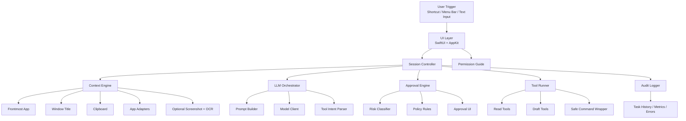

# Across Agents Assistant - 技术架构设计文档

## 1. 文档目标
本文档用于给出 Across Agents Assistant 在 MVP 阶段的推荐技术架构、模块边界、状态机、权限模型、风险控制和分阶段实现方案。目标是指导工程落地，而不是仅提供概念性描述。

## 2. 总体架构判断
### 2.1 推荐架构路线
MVP 推荐采用 **SwiftUI + AppKit 的原生 macOS 应用** 作为前端和系统能力入口，并以以下两种方式之一承载 Agent 核心逻辑：

- **方案 A：Swift 主导**
  - UI、系统能力、上下文采集、Agent 编排、工具执行均由 Swift 实现。
  - 优点是原生整合最强，部署简单。
  - 缺点是初期迭代速度略慢，LLM 生态和已有 Python 代码复用较弱。

- **方案 B：Swift + Python 混合**
  - SwiftUI 负责 UI、权限和系统集成。
  - Python 负责模型调用、工具编排、部分已有能力复用。
  - 两者通过本地 HTTP、Unix Domain Socket 或 stdin/stdout RPC 通信。
  - 优点是便于快速复用已有代码。
  - 缺点是多进程管理、打包和调试更复杂。

### 2.2 MVP 推荐决策
考虑到当前仓库已存在 Python 侧语音、热键、菜单栏等能力雏形，MVP 推荐优先采用 **Swift + Python 混合架构**，以缩短验证周期；中长期再评估是否将核心编排逐步迁移到 Swift。

## 3. 核心设计原则
- **受控执行优先**：先保证可解释和可审批，再提升自动化程度。
- **分层上下文优先**：先拿稳定低成本上下文，再按需拉取重型上下文。
- **最小权限优先**：仅在功能需要时申请 macOS 权限。
- **白名单工具优先**：不向模型暴露开放式任意脚本执行。
- **草稿优先于直接外发**：外部写入和发送操作默认要求用户确认。
- **可观测性优先**：所有任务、审批和失败路径均应留下结构化日志。

## 4. 总体架构图


## 5. 分层模块设计
### 5.1 UI 层
职责：
- 提供状态栏入口、主浮窗、审批弹窗、设置页面、历史页面。
- 展示录音状态、识别状态、任务执行状态和结果。
- 在权限不足、审批中、执行失败时提供可解释反馈。

推荐实现：
- `SwiftUI` 负责界面布局和状态绑定。
- `AppKit` 负责状态栏图标、窗口层级、全局快捷键、浮层行为等原生能力。

核心组件：
- `MenuBarController`
- `MainPanelController`
- `ApprovalDialogController`
- `SettingsViewModel`
- `SessionViewModel`

### 5.2 触发与输入层
职责：
- 统一处理快捷键触发、菜单栏点击、文本输入、语音输入。
- 将用户输入转化为标准任务请求。

推荐能力：
- 全局快捷键监听。
- 按住说话或点击录音开始/停止。
- STT 中间态展示。

明确不做：
- 不做默认后台持续唤醒词监听。

### 5.3 会话控制层
职责：
- 管理一次任务的生命周期。
- 串联上下文采集、模型规划、审批和执行。
- 处理取消、重试、超时和降级。

建议对象：
- `SessionController`
- `TaskStateMachine`
- `ExecutionCoordinator`

### 5.4 上下文引擎
职责：
- 按层级收集上下文。
- 统一输出结构化 `ContextPack`。
- 根据策略决定是否请求更重的上下文。

分层设计：
- **Tier 1：稳定快速**
  - 前台应用名
  - 窗口标题
  - 剪贴板文本
  - 时间、语言环境

- **Tier 2：应用适配**
  - IDE 当前文件路径、选中文本、光标位置
  - 浏览器 URL、页面标题
  - Finder 当前目录

- **Tier 3：重型上下文**
  - 屏幕截图
  - OCR 文本
  - 视觉摘要

实现建议：
- 为每类应用实现 `AppContextAdapter` 协议。
- 不把“读取选中文本”视为通用能力，而视为“可能能力”。

### 5.5 模型编排层
职责：
- 构造 Prompt。
- 调用 LLM。
- 解析结构化输出，包括自然语言回复、执行计划、工具调用意图。

建议组件：
- `PromptBuilder`
- `ModelClient`
- `Planner`
- `ToolIntentParser`

输出契约建议：
- 普通回复模式：返回文本答案和建议下一步。
- 工具规划模式：返回目标、理由、工具列表、参数、风险等级、是否需要审批。

### 5.6 审批引擎
职责：
- 根据规则和工具意图判断风险等级。
- 决定是否阻塞执行并展示审批 UI。
- 记录审批决策。

建议组件：
- `RiskClassifier`
- `PolicyEvaluator`
- `ApprovalCoordinator`

审批输入维度：
- 动作类型
- 目标对象
- 读写范围
- 是否外发
- 是否可逆
- 用户当前模式

### 5.7 工具执行层
职责：
- 承载所有可执行动作。
- 统一校验参数、权限和范围。
- 输出标准执行结果。

MVP 原则：
- 只允许白名单工具。
- 每个工具必须有 schema、权限要求、风险级别、超时配置。
- 不直接暴露 Shell。

### 5.8 审计与存储层
职责：
- 记录任务历史、审批日志、错误信息、性能指标。
- 保存用户设置、白名单配置、偏好项。

推荐存储：
- 配置：`UserDefaults`
- 任务历史和日志：`SQLite`

## 6. 关键数据结构
### 6.1 ContextPack
```json
{
  "request_id": "uuid",
  "user_input": "帮我总结当前页面并写一个跟进邮件草稿",
  "trigger": {
    "type": "shortcut",
    "timestamp": "2026-04-21T10:00:00Z"
  },
  "app_context": {
    "frontmost_app": "Google Chrome",
    "window_title": "客户方案 - Notion",
    "browser_url": "https://example.com",
    "selected_text": null
  },
  "device_context": {
    "clipboard_text": "客户关注交付时间和价格",
    "locale": "zh-CN",
    "timezone": "Asia/Shanghai"
  },
  "screen_context": {
    "screenshot_enabled": false,
    "ocr_text": null
  },
  "policy_context": {
    "approval_mode": "strict",
    "allowed_tools": ["read_clipboard", "create_email_draft"]
  }
}
```

### 6.2 ToolDescriptor
```json
{
  "name": "create_email_draft",
  "risk_level": "L2",
  "required_permissions": ["none"],
  "input_schema": {
    "to": "string?",
    "subject": "string",
    "body": "string"
  },
  "requires_approval": true,
  "timeout_ms": 5000
}
```

### 6.3 ApprovalRequest
```json
{
  "request_id": "uuid",
  "user_goal": "联系客户并确认下周会议",
  "plan_summary": "创建一封邮件草稿，不会直接发送",
  "read_set": ["clipboard_text", "window_title"],
  "write_target": ["mail_draft"],
  "risk_level": "L2",
  "tool_calls": [
    {
      "tool": "create_email_draft",
      "args": {
        "subject": "下周会议确认",
        "body": "..."
      }
    }
  ]
}
```

## 7. 状态机设计
### 7.1 会话状态
推荐状态流转如下：

`Idle -> CapturingInput -> CollectingContext -> Planning -> WaitingForApproval -> Executing -> Completed`

异常分支：

`CollectingContext -> PermissionBlocked -> Idle`

`Planning -> Failed -> Idle`

`WaitingForApproval -> Rejected -> Idle`

`Executing -> Failed -> Idle`

### 7.2 状态机要求
- 每个状态都必须可取消。
- 任一阶段失败都必须向 UI 返回可解释错误。
- 审批等待状态必须支持超时和用户主动关闭。

## 8. 核心执行流程
### 8.1 标准只读任务
1. 用户触发任务。
2. 收集 Tier 1 上下文。
3. 构建 Prompt 并请求 LLM。
4. 返回回复。
5. 记录任务日志。

### 8.2 需要执行的任务
1. 用户触发任务。
2. 收集 Tier 1 上下文。
3. LLM 输出计划和工具意图。
4. 审批引擎进行风险评估。
5. 若需审批则展示审批 UI。
6. 用户同意后执行工具。
7. 汇总结果并展示。
8. 写入审计日志。

### 8.3 权限缺失任务
1. 模块调用系统能力前检查权限。
2. 若权限缺失，则返回结构化错误码。
3. UI 展示权限引导，不应直接崩溃或静默失败。

## 9. 工具系统设计
### 9.1 工具分类
- **读取类工具**
  - `get_frontmost_app`
  - `get_window_title`
  - `read_clipboard`
  - `read_project_file`
  - `list_directory`
  - `get_git_status`

- **草稿类工具**
  - `create_email_draft`
  - `create_note_draft`
  - `write_workspace_file`

- **外部动作类工具**
  - `open_url`
  - `reveal_in_finder`

### 9.2 工具接入规范
每个工具必须声明：
- 名称和版本
- 输入输出 schema
- 所需权限
- 风险等级
- 默认是否审批
- 超时
- 可访问路径或资源范围

### 9.3 Safe Command Wrapper
如果确实需要命令行能力，建议仅通过 `safe_command` 包装器开放极少数命令：
- 白名单命令，例如 `git status`、`git diff --stat`、`ls`。
- 固定工作目录范围。
- 禁止管道、重定向、子命令拼接。
- 限制执行时间、输出大小和环境变量。

MVP 结论：
- 不直接暴露原始 Shell。
- `safe_command` 也应视为高风险边界能力。

## 10. 上下文采集实现建议
### 10.1 通用能力
- 前台应用：通过 `NSWorkspace` 获取。
- 窗口标题：通过 Accessibility API 获取。
- 剪贴板：通过 `NSPasteboard` 获取。

### 10.2 应用适配器
- 浏览器适配器：优先通过 AppleScript 获取 URL 和标签标题。
- Finder 适配器：获取当前目录或选中文件。
- IDE 适配器：优先通过官方能力或 AppleScript 获取当前文件路径；其次尝试 Accessibility。

### 10.3 不稳定点与替代方案
- 选中文本获取不应作为所有 App 的强依赖。
- 当无法获取选中文本时，应提示用户“可先复制到剪贴板后再试”。
- 截图与 OCR 仅在用户显式启用或任务确有必要时执行。

## 11. 权限模型
### 11.1 可能涉及的权限
- 麦克风
- Accessibility
- 屏幕录制

### 11.2 权限申请原则
- 首次启动不一次性申请全部权限。
- 在具体功能触发前给出理由说明，再请求对应权限。
- 权限被拒绝后提供手动开启引导和功能降级路径。

## 12. 安全设计
### 12.1 风险控制
- 工具白名单
- 参数 schema 校验
- 审批网关
- 执行超时
- 范围限制
- 审计日志

### 12.2 日志要求
至少记录以下事件：
- 任务开始与结束
- 上下文来源元数据
- 模型规划结果
- 审批请求与用户决策
- 工具执行结果
- 错误类型与耗时

### 12.3 敏感数据处理
- 剪贴板和截图内容默认短时缓存。
- 历史记录优先保存摘要而非完整原文。
- 允许用户关闭敏感数据持久化。

## 13. 性能设计
### 13.1 响应策略
- 输入结束后立即显示“正在理解”。
- Tier 1 上下文必须轻量快速。
- OCR 和截图应异步化或按需触发，避免阻塞普通任务。

### 13.2 性能目标
- 快捷键到 UI 响应时间小于 100ms。
- 普通问答首屏反馈时间小于 500ms。
- 重型任务尽量在 3 到 6 秒内完成首轮可见反馈。

## 14. 不可直接落地的点与替代方案
### 14.1 通用上下文抓取
问题：
- 无法保证所有应用稳定暴露可读上下文。

替代方案：
- 用应用适配器机制替代“全应用支持”承诺。
- 优先支持浏览器、Finder、IDE、Mail、Notes。

### 14.2 通用 UI 自动化
问题：
- Accessibility 自动化容易因 UI 改版和焦点变化失效。

替代方案：
- 优先提供草稿和建议能力。
- 必要时仅支持少量明确适配的自动操作。

### 14.3 开放式脚本执行
问题：
- 审批和白名单很难完全覆盖任意脚本风险。

替代方案：
- 用受控工具系统替代任意 Shell/Python/Node 执行器。

## 15. 分阶段实施计划
### Phase 1：基础原型
- SwiftUI 状态栏应用
- 全局快捷键
- 文本输入和基础语音输入
- Tier 1 上下文
- LLM 问答

### Phase 2：审批与执行
- 工具注册中心
- 审批引擎
- 草稿型工具
- 日志与历史

### Phase 3：应用适配
- 浏览器适配器
- Finder 适配器
- IDE 适配器
- 可选截图和 OCR

### Phase 4：优化与迁移
- 评估 Python 核心是否迁移到 Swift
- 精简后台资源消耗
- 完善策略系统和用户偏好

## 16. 开发建议结论
结论如下：
- 该方案具备工程可落地性。
- MVP 的关键不是“能力上限”，而是“边界控制”和“体验一致性”。
- 只要坚持原生系统集成、受控工具、渐进式上下文和审批优先，这个项目可以进入真实开发。
- 如果回到“全局唤醒词 + 全自动脚本执行 + 通用 UI 自动化”路线，落地风险会显著升高。
